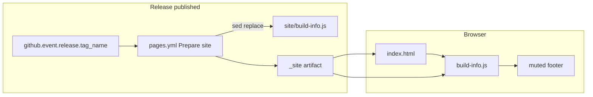

# Build version and environment in footer

opengd77-map displays **build environment** and **build version** in a muted
page footer so support and contributors can tell at a glance which build a
browser tab is running. Values are baked into a small shared JS file during the
GitHub Pages deploy workflow. Local file opens and `python -m http.server`
previews fall back to `"local"` without any configuration.

Adapted from the MyCare Connect pattern (C# + Docker) for this repo's static
HTML/JS layout and tag-only GitHub Pages deploy.

Pair with [git-workflow](../git-workflow/SKILL.md) for releases and
[feature-docs](../feature-docs/SKILL.md) when documenting the feature under
`docs/features/` or `docs/build/`.

---

## Concepts

| Term | Meaning |
| --- | --- |
| **`BUILD_ENV`** | Deployment environment name. Today: `local` or `prod`. |
| **`BUILD_VERSION`** | Version shown beside `BUILD_ENV`. |
| **Placeholder sentinels** | Literal `__BUILD_ENV__` and `__BUILD_VERSION__` in source. If still present at runtime, treat as unbaked local build → fall back to `"local"`. |

### Values by environment

This repo has **no dev/qa/staging** deploy targets today (see
[docs/build/README.md](../../../docs/build/README.md)). Extend this table if
that changes.

| Environment | `BUILD_ENV` | `BUILD_VERSION` |
| --- | --- | --- |
| local | `local` | `local` |
| prod (GitHub Pages from published release) | `prod` | SemVer from release tag, e.g. `1.2.3` (strip leading `v`) |

**Display format:** muted footer text, e.g. `prod · 1.2.3` or `local · local`.

---

## Recommended layout

| Path | Role |
| --- | --- |
| `site/build-info.js` | Single source of truth — placeholder constants + `getBuildInfo()` helper |
| `site/index.html` | Site hub footer |
| `tools/<name>/index.html` | Tool footers (load shared script via relative path) |
| `.github/workflows/pages.yml` | `sed` replacement during **Prepare site** |
| `docs/build/README.md` | Document deploy-time injection |

**Relative script path from tools:** `../../build-info.js` (resolves to
`_site/build-info.js` on Pages and `site/build-info.js` locally).

Do **not** introduce a bundler for this feature alone. No npm, no compile step
for day-to-day dev.

---

## Implementation checklist

When adding or changing build info:

- [ ] Add `site/build-info.js` with placeholders and local fallback
- [ ] Add muted footer markup + CSS to `site/index.html` and each tool page
- [ ] Wire `pages.yml` to set `BUILD_ENV=prod` and `BUILD_VERSION` from tag
- [ ] Copy `site/build-info.js` → `_site/build-info.js` in the prepare step
- [ ] Update [docs/build/README.md](../../../docs/build/README.md) (build-time vars)
- [ ] Smoke-test locally (footer shows `local · local`)
- [ ] Smoke-test after tagging (footer shows `prod · <semver>`)

---

## 1. Shared `build-info.js`

Keep one small sidecar script. Placeholders must be plain string literals so
`sed` can replace them.

```javascript
(function () {
  var env = "__BUILD_ENV__";
  var version = "__BUILD_VERSION__";

  function resolved(value) {
    return value.indexOf("__") === 0 ? "local" : value;
  }

  window.BUILD_INFO = {
    env: resolved(env),
    version: resolved(version),
    label: function () {
      return this.env + " · " + this.version;
    }
  };
})();
```

Tools and the site hub load this with a plain `<script src="...">` before any
inline footer script, or call `BUILD_INFO.label()` from inline markup.

---

## 2. Footer rendering

Match existing UI patterns — `system-ui`, dark background, `--muted` colour
(see `site/index.html` and `tools/channel-map/index.html`).

**Site hub** — add a `<footer>` below `<main>`:

```html
<footer class="site-footer" id="build-info-footer" aria-label="Build info"></footer>
<script src="build-info.js"></script>
<script>
  document.getElementById("build-info-footer").textContent = BUILD_INFO.label();
</script>
```

**Tools** — same pattern; script `src` is `../../build-info.js`.

Style with muted, small type (e.g. `font-size: 0.75rem; color: var(--muted)`).
Do not make build info prominent — it is for debugging, not branding.

---

## 3. `pages.yml` injection

Extend the **Prepare site** step. The workflow runs on `release: types: [released]`.
Set env vars from the release tag, `sed` the shared JS file, then assemble `_site/`:

```yaml
- name: Prepare site
  env:
    BUILD_ENV: prod
    BUILD_VERSION: ${{ github.event.release.tag_name }}
  run: |
    # Strip leading v from tag (v1.2.3 → 1.2.3)
    VERSION="${BUILD_VERSION#v}"
    sed -i "s|__BUILD_ENV__|${BUILD_ENV}|g" site/build-info.js
    sed -i "s|__BUILD_VERSION__|${VERSION}|g" site/build-info.js
    mkdir -p _site
    cp site/index.html _site/index.html
    cp site/build-info.js _site/build-info.js
    cp -r tools _site/tools
```

**Important:** `sed` mutates the checked-out file in the runner workspace only
— source in git keeps placeholders. Do not commit the rewritten file.

### Sed delimiter

Always use `|`, not `/`, so version strings containing `/` do not break
replacement (relevant if prerelease tags are added later, e.g. `v1.2.3-rc.4`).

### Tag source

Workflow triggers on a published full GitHub release (not a pre-release).
`github.event.release.tag_name` is the release tag (e.g. `v1.0.0`). Strip `v`
for display.

---

## 4. Local development

| Scenario | Expected footer |
| --- | --- |
| Open `site/index.html` or `tools/<name>/index.html` directly | `local · local` |
| `python -m http.server` from repo root | `local · local` |
| Simulate CI output | Run the `sed` + `cp` commands locally against a throwaway copy; serve `_site/` |

No workflow or env vars needed for local work.

---

## Data flow



---

## Edge cases and future extensions

- **Placeholder leakage** — footer shows `__BUILD_ENV__` → `sed` did not run
  (file moved, placeholder renamed, or prepare step skipped). Check workflow.
- **No staging yet** — unlike MyCare, there is only prod on Pages. If PR previews
  or a staging host are added later, extend the values table and pass a
  different `BUILD_ENV` in that workflow.
- **Prerelease tags** — `v1.2.3-rc.1` works as-is; display the tag minus `v`.
- **Bundler later** — if a build tool is introduced, keep the same placeholder
  contract or migrate to `define`/env injection; update this skill when that
  happens.
- **Multiple tools** — one shared `site/build-info.js`; do not duplicate
  placeholders per tool.

---

## Documentation

When shipping this feature:

1. Add a **Build-time variables** subsection to
   [docs/build/README.md](../../../docs/build/README.md).
2. Optionally add `docs/features/build/version-number.md` (or a section in the
   build README) with the values table and verify steps.
3. Note footer verify in post-deploy checklist: open the live site and confirm
   `prod · <semver>` matches the tag just pushed.
