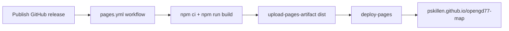

# Build and deploy

How the opengd77-map **Vite + React SPA** reaches **GitHub Pages**. The build runs `npm ci` and `npm run build`, producing a `dist/` folder for hosting.

## Implementation status

| Area | Status | Notes |
| --- | --- | --- |
| SPA source layout | Shipped (Ticket A) | Root `index.html`, `src/`, Vite config |
| CI workflow | Shipped | `.github/workflows/pages.yml` — Node setup + `npm run build` |
| Release-triggered deploy | Shipped | Publish full GitHub release → GitHub Actions → Pages |
| Build version footer | Shipped | Vite `define` injects `BUILD_ENV` / `BUILD_VERSION`; `BuildFooter` component |
| Legacy static tools | Retired (Ticket C) | SPA-only; `site/` and `tools/` removed |
| Merge-to-main auto deploy | Not used | Releases are explicit via published GitHub releases only |

## Documentation map

| Doc | Covers |
| --- | --- |
| [README.md](../../README.md) | User-facing overview and live site link |
| [AGENTS.md](../../AGENTS.md) | Agent layout table and working principles |
| [docs/build/spa/](spa/) | SPA migration progress and outstanding logs |
| [docs/features/map/](../features/map/README.md) | Channel map behaviour and verify steps |

## Concepts

| Term | Meaning |
| --- | --- |
| **Source tree** | What lives in git — `src/`, `index.html`, config, docs, agent files |
| **Build artifact** | `dist/` folder CI produces per run via `npm run build` |
| **Release** | A published (non-pre-release) GitHub release, created from a tag matching `v*` (e.g. `v1.0.0`) |
| **Project Pages URL** | `https://pskillen.github.io/opengd77-map/` |
| **`BUILD_ENV`** | Deployment environment baked in at build time via Vite `define` (`local` or `prod`) |
| **`BUILD_VERSION`** | Version string baked alongside `BUILD_ENV` (SemVer from release tag on Pages) |

## Repository layout (deploy-relevant)

| Path | Role |
| --- | --- |
| `index.html` | Vite entry HTML |
| `src/` | React app source |
| `vite.config.ts` | Vite config — `base`, `define` for build info |
| `dist/` | Build output (gitignored; uploaded to Pages) |
| `.github/workflows/pages.yml` | Release-triggered deploy workflow |
| `docs/`, `.cursor/`, `AGENTS.md` | **Not** published — contributor/agent material only |

## Deploy flow



### Workflow steps

1. **Trigger** — a published GitHub release (`release: types: [released]`, i.e. not a pre-release), created from a tag matching `v*` (e.g. `v1.0.0`).
2. **Setup** — `actions/setup-node@v4` with `node-version-file: .nvmrc`, `cache: npm`.
3. **Install** — `npm ci`.
4. **Build** — `npm run build` with `BUILD_ENV=prod` and `BUILD_VERSION` from `github.event.release.tag_name`.
5. **Upload** — `actions/upload-pages-artifact` with `path: dist`.
6. **Deploy** — `actions/deploy-pages` to the `github-pages` environment.

Workflow file: [`.github/workflows/pages.yml`](../../.github/workflows/pages.yml).

### Build-time variables

Neither variable is a runtime environment variable in the browser — they are injected at **build time** via Vite `define` in `vite.config.ts`. Local dev builds without env vars fall back to `local · local`.

| Variable | Set in CI | Local default | Notes |
| --- | --- | --- | --- |
| `BUILD_ENV` | `prod` | `local` | Passed to `vite.config.ts`; becomes `__BUILD_ENV__` |
| `BUILD_VERSION` | Tag name minus leading `v` | `local` | From `github.event.release.tag_name` |

Agent skill: [`.cursor/skills/version-number/SKILL.md`](../../.cursor/skills/version-number/SKILL.md).

### One-time repository setup

In GitHub **Settings → Pages**:

- **Source:** GitHub Actions (not “Deploy from a branch”).

The workflow needs `pages: write` and `id-token: write` (already set in the workflow).

## Cutting a release

From `main` after merging the release PR, push a `v*` tag, then publish a full GitHub release from that tag:

```bash
git checkout main
git pull origin main
git tag v1.0.0
git push origin v1.0.0
```

Then, in the GitHub **Releases** UI, draft a release from tag `v1.0.0`, add notes, and **Publish release** (leave **Set as a pre-release** unchecked).

> Publishing the release (not a pre-release) is what triggers the deploy. Pushing the tag alone does **not** deploy. Mark the release as a pre-release to publish notes without deploying.

Monitor the **Actions** tab for the “Deploy GitHub Pages” workflow. When it completes, the site updates at the project Pages URL.

## Local development

| Goal | Command / action |
| --- | --- |
| Dev server | `npm install` then `npm run dev` — visit `http://localhost:5173/opengd77-map/` |
| Production build | `npm run build` — output in `dist/` |
| Preview production build | `npm run preview` |
| Lint / format / test | `npm run lint`, `npm run format:check`, `npm run test` |
| Simulate prod footer | `BUILD_ENV=prod BUILD_VERSION=v1.2.3 npm run build && npm run preview` |

Use CSV fixtures from gitignored `sample-exports/`.

## Manual verify (post-deploy)

1. Open `https://pskillen.github.io/opengd77-map/`.
2. Confirm muted footer shows `prod · <semver>` matching the release tag.
3. Navigate to the channel map route (`/#/map`).
4. Load sample `Channels.csv` / `Zones.csv`; confirm markers and zone hulls render.

## Known gaps

- No staging environment — publishing a release updates production Pages.
- No cache-busting beyond Vite content hashes in `dist/assets/`.
- Workflow does not run on PRs or tag pushes (published-release-only).

## Cross-links

| Resource | URL |
| --- | --- |
| Live site | https://pskillen.github.io/opengd77-map/ |
| Git workflow skill | [`.cursor/skills/git-workflow/SKILL.md`](../../.cursor/skills/git-workflow/SKILL.md) |
| Feature docs skill | [`.cursor/skills/feature-docs/SKILL.md`](../../.cursor/skills/feature-docs/SKILL.md) |
| SPA migration progress | [spa/spa-migration-progress.md](spa/spa-migration-progress.md) |
