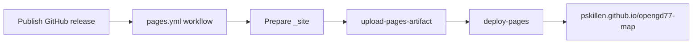

# Build and deploy

How static tools in this monorepo reach **GitHub Pages**. There is no application bundler — the “build” is assembling a small folder of HTML, JS, and assets for hosting.

## Implementation status

| Area | Status | Notes |
| --- | --- | --- |
| Source layout | Shipped | Tools under `tools/<name>/`; site hub at `site/index.html` |
| CI workflow | Shipped | `.github/workflows/pages.yml` |
| Release-triggered deploy | Shipped | Publish full GitHub release → GitHub Actions → Pages |
| Build version footer | Shipped | `site/build-info.js` injected at deploy; muted footer on site hub and tools |
| Merge-to-main auto deploy | Not used | Releases are explicit via published GitHub releases only |

## Documentation map

| Doc | Covers |
| --- | --- |
| [README.md](../../README.md) | User-facing overview and live site link |
| [AGENTS.md](../../AGENTS.md) | Agent layout table and working principles |
| [docs/features/map/](../features/map/README.md) | Channel map behaviour and verify steps |

## Concepts

| Term | Meaning |
| --- | --- |
| **Source tree** | What lives in git — `tools/`, `site/`, docs, agent files |
| **Site artifact** | `_site/` folder CI builds per run: `index.html` + `tools/` |
| **Release** | A published (non-pre-release) GitHub release, created from a tag matching `v*` (e.g. `v1.0.0`) |
| **Project Pages URL** | `https://pskillen.github.io/opengd77-map/` |
| **`BUILD_ENV`** | Deployment environment baked into `site/build-info.js` at CI time (`local` or `prod`) |
| **`BUILD_VERSION`** | Version string baked alongside `BUILD_ENV` (SemVer from release tag on Pages) |

## Repository layout (deploy-relevant)

| Path | Role |
| --- | --- |
| `site/index.html` | Pages root — lists available tools |
| `site/build-info.js` | Shared build env/version script (placeholders rewritten in CI) |
| `tools/<tool>/` | Deployed tool directories (`index.html`, sidecar `.js`, etc.) |
| `.github/workflows/pages.yml` | Release-triggered deploy workflow |
| `docs/`, `.cursor/`, `AGENTS.md` | **Not** published — contributor/agent material only |

## Deploy flow



### Workflow steps

1. **Trigger** — a published GitHub release (`release: types: [released]`, i.e. not a pre-release), created from a tag matching `v*` (e.g. `v1.0.0`).
2. **Prepare** — rewrite `__BUILD_ENV__` / `__BUILD_VERSION__` in `site/build-info.js` from the release tag, then copy `site/index.html`, `site/build-info.js`, and `tools/` into `_site/`.
3. **Upload** — `actions/upload-pages-artifact` with `path: _site`.
4. **Deploy** — `actions/deploy-pages` to the `github-pages` environment.

Workflow file: [`.github/workflows/pages.yml`](../../.github/workflows/pages.yml).

### Build-time variables

Neither variable is a runtime environment variable — they are substituted into
`site/build-info.js` during the **Prepare site** step only. Source in git keeps
placeholder sentinels; local opens fall back to `local · local`.

| Variable | Set in CI | Local default | Notes |
| --- | --- | --- | --- |
| `BUILD_ENV` | `prod` | `local` | Placeholder `__BUILD_ENV__` |
| `BUILD_VERSION` | Tag name minus leading `v` | `local` | Placeholder `__BUILD_VERSION__`; from `github.event.release.tag_name` |

Agent skill: [`.cursor/skills/version-number/SKILL.md`](../../.cursor/skills/version-number/SKILL.md).

### One-time repository setup

In GitHub **Settings → Pages**:

- **Source:** GitHub Actions (not “Deploy from a branch”).

The workflow needs `pages: write` and `id-token: write` (already set in the workflow).

## Cutting a release

From `main` after merging the release PR, push a `v*` tag, then publish a full GitHub release from that tag:

```bash
git checkout main
git pull origin main
git tag v1.0.0
git push origin v1.0.0
```

Then, in the GitHub **Releases** UI, draft a release from tag `v1.0.0`, add notes, and **Publish release** (leave **Set as a pre-release** unchecked).

> Publishing the release (not a pre-release) is what triggers the deploy. Pushing the tag alone does **not** deploy. Mark the release as a pre-release to publish notes without deploying.

Monitor the **Actions** tab for the “Deploy GitHub Pages” workflow. When it completes, the site updates at the project Pages URL.

## Local development

No build step is required for day-to-day work.

| Goal | Command / action |
| --- | --- |
| Run channel map | Open `tools/channel-map/index.html` in a browser, or `python -m http.server` from repo root and visit `/tools/channel-map/` |
| Preview site hub | Open `site/index.html` locally (tool links use relative paths) |
| Simulate CI output | Copy and `sed` per workflow, or `mkdir -p _site && cp site/index.html site/build-info.js _site/ && cp -r tools _site/tools` for layout-only preview |

Use CSV fixtures from gitignored `sample-exports/`.

## Adding a new tool

1. Add `tools/<slug>/index.html` (and sidecar JS/CSS as needed).
2. Link it from `site/index.html`.
3. Add contributor docs under `docs/features/<topic>/`.
4. Tag a release when ready to publish — no workflow change unless the tool lives outside `tools/`.

## Manual verify (post-deploy)

1. Open `https://pskillen.github.io/opengd77-map/`.
2. Confirm muted footer shows `prod · <semver>` matching the release tag.
3. Follow **Channel map** → loads `tools/channel-map/`.
4. Load sample `Channels.csv` / `Zones.csv`; confirm markers and zone hulls render.
5. Confirm channel map footer also shows `prod · <semver>`.

## Known gaps

- No staging environment — publishing a release updates production Pages.
- No cache-busting beyond browser defaults; publish a new release to redeploy unchanged files.
- Workflow does not run on PRs or tag pushes (published-release-only).

## Cross-links

| Resource | URL |
| --- | --- |
| Live site | https://pskillen.github.io/opengd77-map/ |
| Channel map (deployed) | https://pskillen.github.io/opengd77-map/tools/channel-map/ |
| Git workflow skill | [`.cursor/skills/git-workflow/SKILL.md`](../../.cursor/skills/git-workflow/SKILL.md) |
| Feature docs skill | [`.cursor/skills/feature-docs/SKILL.md`](../../.cursor/skills/feature-docs/SKILL.md) |
