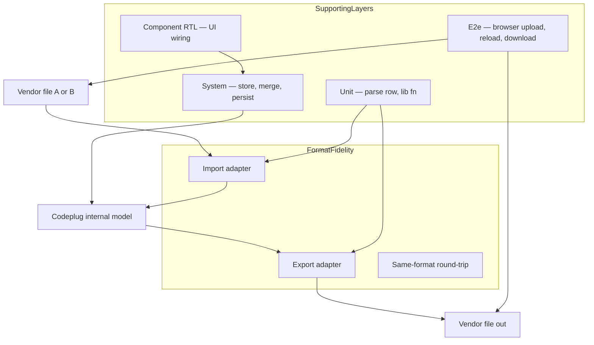

# Testing strategy

Contributor guide for automated tests in the MM9PDY Codeplug Tool SPA.

**Tracking:** [codeplug-tool#78](https://github.com/pskillen/codeplug-tool/issues/78)

## North star

**Vendor format fidelity** is the primary guarantee we need from tests: importers faithfully map vendor files → internal [codeplug model](../../features/data-model/README.md); exporters map internal model → vendor files; and multi-step paths (re-import, merge, manual CRUD, persistence) preserve data integrity across those boundaries.

Supporting layers — unit tests for library functions, system/workflow tests through the store, RTL component tests, and Playwright e2e — exist to support that guarantee without duplicating it. See [format-fidelity.md](format-fidelity.md) for the full scenario taxonomy.

These docs describe **how we should test** (prescriptive). They are not a reverse-engineered audit of every existing `*.test.ts` file. Audit notes from the #78 initiative live in [testing-gaps.md](testing-gaps.md) for optional follow-up tickets.

## Test layers

| Layer | Doc | Proves | Must not duplicate |
| --- | --- | --- | --- |
| Format fidelity | [format-fidelity.md](format-fidelity.md) | Adapter boundary correctness, round-trip semantics | Browser UI, localStorage |
| Unit | [unit.md](unit.md) | Single function, parser row, serialiser column | Full multi-file workflow |
| Fixtures | [fixtures.md](fixtures.md) | Shared CSV bundles, normalisation rules | — |
| System | [system.md](system.md) | Store, merge, persistence, CRUD between import/export | File picker, download events |
| Component | [component.md](component.md) | Modal copy, mode select, confirm/cancel wiring | CSV byte equality |
| E2e | [e2e.md](e2e.md) | Real browser: upload, reload, ZIP download, file diff | Parser edge cases in unit |

## npm scripts

| Script | Command | Scope |
| --- | --- | --- |
| All Vitest | `npm test` | Unit, component, adapter integration (`src/**/*.test.ts(x)`) |
| Watch | `npm run test:watch` | Same, interactive |
| System + import UI | `npm run test:system` | `src/test/system/`, `ImportIntoActivePanel` |
| Coverage | `npm run test:coverage` | Full Vitest suite with `@vitest/coverage-v8` (same scope as `npm test`) |
| E2e | `npm run test:e2e` | Planned — [#40](https://github.com/pskillen/codeplug-tool/issues/40) |

Run before commit: `npm run lint`, `npm run format:check`, `npm test`, and `npm run test:system` when touching import/merge/store paths. See [git-workflow](../../../.cursor/skills/git-workflow/SKILL.md).

## CI on pull requests

Every pull request and push to `main` runs [`.github/workflows/checks.yaml`](../../.github/workflows/checks.yaml) (**Checks** workflow):

| Check | Script | CI | Notes |
| --- | --- | --- | --- |
| ESLint | `npm run lint` | Yes | |
| Prettier | `npm run format:check` | Yes | |
| Unit + component + system | `npm run test:coverage` | Yes | Full Vitest suite; JUnit → [dorny/test-reporter](https://github.com/dorny/test-reporter) check with every test name; coverage report-only in v1 |
| E2e | `npm run test:e2e` | When #40 lands | Playwright + browser install (commented placeholder in workflow) |
| Type-check + build | `npm run build` | Yes | `tsc -b && vite build` |

`npm run test:system` remains a **local focused script** for import/merge work; CI runs the full suite via `test:coverage`.

**Reading results:** the **Vitest** check run lists every test with pass/fail; the job **Summary** also includes coverage percentages. Download **test-results** or **coverage-report** artifacts for JUnit XML / lcov detail. No fail-on-threshold for coverage in v1.

## Where to add tests

1. **Changing a parser or serialiser column** → unit test beside `parse.ts` / `serialise.ts`; extend round-trip or format-fidelity scenario if semantics cross files.
2. **Changing merge / active import / store apply** → `importMerge.test.ts` for logic; system scenario in `src/test/system/` for multi-step workflow.
3. **Changing import/export UI only** → component RTL (`ImportIntoActivePanel.test.tsx`) or e2e when browser behaviour matters (file picker, download).
4. **New vendor adapter** → register in import/export registry; reference docs under `docs/reference/<vendor>/`; fixture bundle; fill adapter matrix in [format-fidelity.md](format-fidelity.md).
5. **Pure lib helper** (geo, validation, csv) → colocated `*.test.ts`; every exported function should have coverage.

## Documentation map

| Doc | Contents |
| --- | --- |
| [format-fidelity.md](format-fidelity.md) | **Primary** — scenario taxonomy, adapter matrix, lossy fields |
| [unit.md](unit.md) | Colocated Vitest, jsdom setup, unit vs integration |
| [fixtures.md](fixtures.md) | Committed bundles, normalisation, `sample-exports/` policy |
| [system.md](system.md) | Workflow harness, merge scenarios, persistence |
| [component.md](component.md) | RTL patterns, provider wrapping |
| [e2e.md](e2e.md) | Playwright scope and phased suite |
| [testing-strategy-progress.md](testing-strategy-progress.md) | #78 execution log (point in time) |
| [testing-strategy-outstanding.md](testing-strategy-outstanding.md) | #78 handoff only |
| [testing-gaps.md](testing-gaps.md) | Audit notes for optional rework tickets |

## Related

| Resource | Link |
| --- | --- |
| Build and deploy | [docs/build/README.md](../README.md) |
| Import feature | [docs/features/import/README.md](../../features/import/README.md) |
| Export feature | [docs/features/export/README.md](../../features/export/README.md) |
| Data model | [docs/features/data-model/README.md](../../features/data-model/README.md) |
| OpenGD77 wire format | [docs/reference/opengd77/](../../reference/opengd77/README.md) |
| PR checks | [`.github/workflows/checks.yaml`](../../.github/workflows/checks.yaml) — shipped [#79](https://github.com/pskillen/codeplug-tool/issues/79) |
| Playwright e2e (planned) | [#40](https://github.com/pskillen/codeplug-tool/issues/40) |
