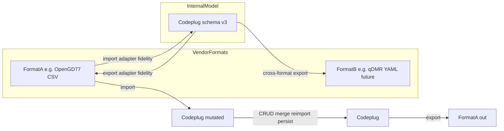

# Format fidelity

**Purpose:** Define how we prove vendor ↔ internal model conversions are correct. This is the **primary** testing concern for import/export work. For layer boundaries and npm scripts, see the [testing hub](README.md).

**Authoritative contract:** [import-export-fidelity-contract.md](../../features/import-export/import-export-fidelity-contract.md) — tier promises (import, export validity, semantic round-trip, cross-format) and what we deliberately let slip (byte/file reproduction). This doc describes *how* to test those tiers.

## Internal model as hub

All vendor formats convert through the radio-agnostic [codeplug model](../../features/data-model/README.md) (`src/models/codeplug.ts`). Import adapters parse vendor files into entities; export adapters serialise entities back to vendor columns. Feature code (map, CRUD, store) works on the internal model only.

Wire-format column detail: [docs/reference/opengd77/](../../reference/opengd77/README.md). Strategy docs cite **outcomes** (round-trip, lossy fields), not every column.

## Import fidelity

**Definition:** Each vendor row maps to the correct internal entity fields.

| Concern | Where to test |
| --- | --- |
| Column → field mapping | Unit tests beside `parse.ts` |
| File classification | `import/index.test.ts`, adapter `detectKind` |
| Multi-file batch assembly | `importFiles` integration tests |
| Enum / boolean conversion | Per-column unit cases |

**Rules:**

- Parse by **header name**, never column index.
- Channel names are **case-sensitive** foreign keys across OpenGD77 files.
- Rows that fail validation should be reported in `ImportResult.errors`; skipped files in `skipped`.

**Code anchors:** [`src/lib/import/index.ts`](../../../src/lib/import/index.ts), [`src/lib/import/opengd77/parse.ts`](../../../src/lib/import/opengd77/parse.ts), [`src/lib/import/registry.ts`](../../../src/lib/import/registry.ts).

## Export fidelity

**Definition:** Each internal entity maps to the correct vendor columns and values.

| Concern | Where to test |
| --- | --- |
| Field → column mapping | Unit tests beside `serialise.ts` |
| Name-based FK denormalisation | Zone members, TG list members, channel contact/RX refs |
| Header-only files | DTMF/APRS — see lossy fields below |

**Code anchors:** [`src/lib/export/opengd77/serialise.ts`](../../../src/lib/export/opengd77/serialise.ts), [`src/lib/export/registry.ts`](../../../src/lib/export/registry.ts).

## Scenario taxonomy

Every import/export change should consider which scenarios apply:

| Scenario | What it proves | Layer | Example |
| --- | --- | --- | --- |
| **Import fidelity** | Vendor row → correct internal fields | Unit + adapter | `parse.test.ts`, `index.test.ts` |
| **Export fidelity** | Internal entity → correct vendor columns | Unit + adapter | `serialise` unit tests, round-trip |
| **Same-format round-trip** | A → internal → A preserves semantics | Adapter integration | `roundtrip.test.ts` |
| **Re-import / merge** | Incremental imports idempotent; stable ids | System | `importMerge.test.ts`, `activeImport.system.test.ts` |
| **Manual manipulation** | CRUD between import and export reflected in export | System (+ e2e later) | import → `codeplugMutations` → export diff |
| **Persistence round-trip** | Reload does not corrupt model | System + e2e | `codeplugStorage.test.ts`; Playwright reload [#40](https://github.com/pskillen/codeplug-tool/issues/40) |
| **Cross-format** | A → internal → B | Adapter matrix | `crossFormat.test.ts` (OpenGD77 → CHIRP) |
| **Lossy fields** | Known non-round-trip columns documented | Reference + fidelity tests | DTMF/APRS header-only; `vendorExtras` |

### Same-format round-trip (Tier 3)

The canonical integration test: import a fixture bundle → serialise → re-import → compare **semantic model equality**. Byte-identical CSV is not required — see the [fidelity contract](../../features/import-export/import-export-fidelity-contract.md).

Pattern in [`roundtrip.test.ts`](../../../src/lib/export/opengd77/roundtrip.test.ts):

- Deterministic ids via `setIdGenerator` in `beforeEach`.
- `stripIds()` removes internal `id` and resolved `memberChannelIds` before deep equality.
- Assert substantive fields match, not byte-identical CSV (serialiser may reorder or format).

### Re-import and merge

After [#58](https://github.com/pskillen/codeplug-tool/issues/58): merge mode matches by vendor name, applies field deltas only, preserves internal ids. System tests must prove:

- Re-importing unchanged CSV is a **no-op** (`unchanged` counts, stable ids).
- Partial file import touches only entity types present in the batch.
- Zone `memberChannelIds` re-resolve from `sourceMemberNames` after channel changes.

Harness: [`runActiveImportWorkflow`](../../../src/test/system/importWorkflow.ts).

## Adapter fidelity matrix

Extend this table as vendors ship. Each **cell** lists required test types for that import×export pair.

| Import ↓ / Export → | OpenGD77 CSV | CHIRP CSV | DM32 CSV | qDMR YAML (future) |
| --- | --- | --- | --- | --- |
| **OpenGD77 CSV** | Unit parse/serialise, `roundtrip.test.ts` (semantic), `opengd77RoundTrip.system.test.ts` (import torture + semantic round-trip on `test-data/`), system merge scenarios | `crossFormat.test.ts` — analogue channels only | Cross-format golden (future) | Cross-format golden (future) |
| **CHIRP CSV** | `roundtrip.test.ts` (semantic), `chirpRoundTrip.system.test.ts` (file diff with documented exclusions) | Cross-format golden (future) | Cross-format golden (future) | Cross-format golden (future) |
| **DM32 CSV** | Cross-format golden (future) | Cross-format golden (future) | `parse.test.ts`, `roundtrip.test.ts` (synthetic), `dm32RoundTrip.system.test.ts` (v1.60) | Cross-format golden (future) |
| **qDMR YAML (future)** | Cross-format golden (future) | Cross-format golden (future) | Cross-format golden (future) | Vendor-specific round-trip |

### New vendor checklist

1. Add adapter to [`src/lib/import-export/registry.ts`](../../../src/lib/import-export/registry.ts) (re-exported from import/export registries).
2. Author reference docs under `docs/reference/<vendor>/`.
3. Add committed fixture bundle under `src/test/<vendor>/` — see [fixtures.md](fixtures.md).
4. Fill matrix row/column with required scenarios.
5. Link feature README implementation status.

## Lossy vs lossless fields

Document known non-round-trip behaviour in reference docs; assert it in fidelity tests.

| Area | Behaviour | Reference |
| --- | --- | --- |
| DTMF / APRS | Header-only in export ZIP; skipped on import; not modelled | [dtmf-aprs.md](../../reference/opengd77/dtmf-aprs.md) |
| OpenGD77 mode-dependent columns | Tone/squelch/DMR ID/Contact/TG List wire from model + mode — see [channels.md](../../reference/opengd77/channels.md#mode-dependent-columns) | Export `channelWire.ts` |
| `vendorExtras` | Opaque columns round-trip via map on channel | [file-format.md](../../reference/opengd77/file-format.md) |
| App-only fields | e.g. `hideFromMap` — preserved on merge, not in CSV | [importMerge.ts](../../../src/lib/importMerge.ts) |
| `Comment` (CHIRP) | Not on internal `Channel` model — dropped on import | [channels.md](../../reference/chirp/channels.md) |
| DM32 `Scan List` / `DMR ID` | Export `None` / profile default; excluded from v1.60 system compare | [channels.md](../../reference/dm32/channels.md) |
| DM32 `Scan.csv` / `DMR-ID.csv` | Skipped on import; omitted from export ZIP | [dm32/README.md](../../reference/dm32/README.md) |
| Internal ids | Stripped from semantic compare; reassigned on overwrite | `stripIds` in round-trip tests |

## Normalisation for compares

Shared rules (detail in [fixtures.md](fixtures.md)):

- **Semantic model compare:** strip `id`, `memberChannelIds`; compare import-mapped fields.
- **File-level diff (e2e):** normalise line endings, trim, trailing newline before per-CSV assert.
- **FK resolution:** case-sensitive channel names (OpenGD77).

## Layer boundaries

Format-fidelity tests must **not** duplicate:

| Owned elsewhere | Why |
| --- | --- |
| Browser file picker, download | E2e [#40](https://github.com/pskillen/codeplug-tool/issues/40) |
| Modal confirm copy | Component RTL |
| Raw store reducer edge without import path | Unit/store tests — unless part of merge workflow |

## Related

- [Testing hub](README.md)
- [Import / export fidelity contract](../../features/import-export/import-export-fidelity-contract.md)
- [Import / export feature](../../features/import-export/README.md)
- [System tests](system.md) — merge, persistence, CRUD paths
- [Fixtures](fixtures.md) — bundles and diff rules
