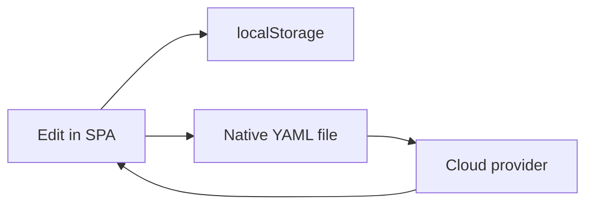

# Cloud storage

Interchange layer for opening and saving codeplug files in cloud providers — complements [LocalStorage persistence](../persistence/README.md), does not replace it.

**Tracking:** Google Drive [#17](https://github.com/pskillen/codeplug-tool/issues/17); Dropbox [#15](https://github.com/pskillen/codeplug-tool/issues/15); OneDrive [#16](https://github.com/pskillen/codeplug-tool/issues/16)

## Model

Operators edit in the app; working state persists in the browser. Cloud is for **explicit open/save** of YAML projects and CPS exports.

## Implementation status

| Provider | Status | Docs |
| --- | --- | --- |
| Google Drive | In progress ([#17](https://github.com/pskillen/codeplug-tool/issues/17)) | [google-drive/](google-drive/README.md) |
| Dropbox | Planned ([#15](https://github.com/pskillen/codeplug-tool/issues/15)) | — |
| OneDrive | Planned ([#16](https://github.com/pskillen/codeplug-tool/issues/16)) | — |

## Privacy

OAuth tokens stay in browser `localStorage` only — never in the repo. See [AGENTS.md](../../../AGENTS.md).

## Related

- [Native YAML](../import-export/native-yaml/README.md)
- [Operator lifecycle](../workflows/operator-lifecycle.md)
- [Build / OAuth client ID](../../build/README.md)
