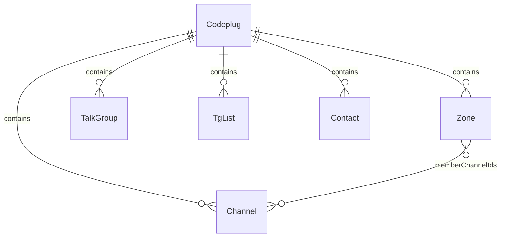
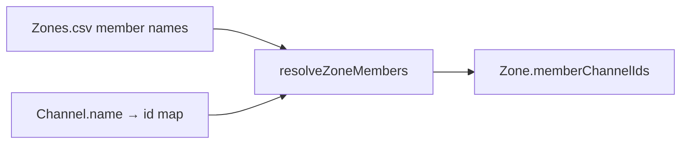

# Internal data model

Canonical reference for the vendor-neutral **codeplug** models used across tools. Import and export docs describe ETL at the format boundary; this document describes **what the models are**.

**Tracking:** [codeplug-tool#7](https://github.com/pskillen/codeplug-tool/issues/7)

## Overview

A **codeplug** is the in-memory working set for one CPS layout: channels, zones, and (later) talk groups, TG/RX-group lists, and contacts. Tools consume these models — not raw CSV.

**Source:** [`src/models/codeplug.ts`](../../../src/models/codeplug.ts)

## Design principles

| Principle | Detail |
| --- | --- |
| **Stable internal ids** | Every entity has `id: string` (`crypto.randomUUID()` via `newId()`). Relationships reference ids, not names. |
| **Vendor names are display fields** | `Channel.name`, `Zone.name`, etc. are preserved for UI and export round-trip but are **not** internal foreign keys. |
| **Name matching at import only** | OpenGD77 zone members arrive as channel **names**. `buildNameToChannelId` / `resolveZoneMembers` in [`src/lib/codeplug.ts`](../../../src/lib/codeplug.ts) resolve names → ids once at the store boundary (case-sensitive, first-wins). |
| **JSON-serialisable** | Plain data objects for persistence ([#9](https://github.com/pskillen/codeplug-tool/issues/9)) and future YAML export. |
| **Schema versioned** | `CodeplugMeta.schemaVersion` (`CODEPLUG_SCHEMA_VERSION = 1`) gates deserialisation. |

## Entities

### `Codeplug`

| Field | Type | Notes |
| --- | --- | --- |
| `channels` | `Channel[]` | |
| `zones` | `Zone[]` | |
| `talkGroups` | `TalkGroup[]` | Stub — empty on OpenGD77 import today |
| `tgLists` | `TgList[]` | Stub |
| `contacts` | `Contact[]` | Stub |
| `meta` | `CodeplugMeta` | Import metadata |

### `Channel`

| Field | Type | Internal / vendor |
| --- | --- | --- |
| `id` | `string` | **Internal** — stable relationship key |
| `name` | `string` | Vendor/display (OpenGD77 `Channel Name`) |
| `callsign` | `string` | Derived — first word of `name` |
| `mode` | `'analogue' \| 'digital' \| 'other'` | Normalised from `Channel Type` |
| `rxFrequency` | `string` | Vendor |
| `txFrequency` | `string` | Vendor |
| `contactName` | `string` | Vendor (`Contact`) |
| `rxGroupListName` | `string` | Vendor (`TG List`) |
| `location` | `GeoPoint \| null` | `{ lat, lon }` or null |
| `useLocation` | `boolean` | Vendor (`Use Location = Yes`) |
| `number` | `string` | Vendor (`Channel Number`) |

### `Zone`

| Field | Type | Internal / vendor |
| --- | --- | --- |
| `id` | `string` | **Internal** |
| `name` | `string` | Vendor (`Zone Name`) |
| `memberChannelIds` | `string[]` | **Internal** — resolved channel ids |
| `sourceMemberNames` | `string[]` | Vendor wire names from `Channel1`…`Channel80`; kept for re-resolution, unresolved reporting, and export ([#8](https://github.com/pskillen/codeplug-tool/issues/8)) |

**Why `sourceMemberNames`?** Vendor exports only carry names. When channels are re-imported (new ids), zones re-resolve `sourceMemberNames` → `memberChannelIds` in the store reducer so memberships stay correct.

### Stubs (typed, not populated yet)

| Entity | Fields | Future use |
| --- | --- | --- |
| `TalkGroup` | `id`, `name`, `number` | DMR talk groups |
| `TgList` | `id`, `name`, `memberContactNames` | RX group lists |
| `Contact` | `id`, `name`, `number` | DMR contacts |

### `CodeplugMeta`

| Field | Type | Notes |
| --- | --- | --- |
| `schemaVersion` | `number` | Must match `CODEPLUG_SCHEMA_VERSION` on load |
| `importedAt` | `string \| null` | ISO timestamp of last successful import |
| `sourceFiles` | `string[]` | Recognised filenames from import |

## Relationship resolution

Only [`src/lib/codeplug.ts`](../../../src/lib/codeplug.ts) and the [`codeplugStore`](../../../src/state/codeplugStore.tsx) reducer perform name→id matching. Map tools look up channels by **id**.

## Planned extensions

### Nested zones ([#33](https://github.com/pskillen/codeplug-tool/issues/33))

Future `Zone.memberZoneIds: string[]` will allow zones to contain other zones (acyclic DAG). Effective channel membership will be computed by flattening child zones and de-duplicating by channel id. **Not importable** from flat vendor exports; **denormalised to flat channel lists on export** ([#8](https://github.com/pskillen/codeplug-tool/issues/8)).

### Multi-project codeplugs ([#31](https://github.com/pskillen/codeplug-tool/issues/31))

Multiple codeplug projects with an active-project switcher; persistence will store the project set ([#9](https://github.com/pskillen/codeplug-tool/issues/9), [#32](https://github.com/pskillen/codeplug-tool/issues/32)).

## Related

- [Import (ETL)](../import/README.md)
- [Map — channels](../map/channels.md)
- [Map — zones](../map/zones.md)
