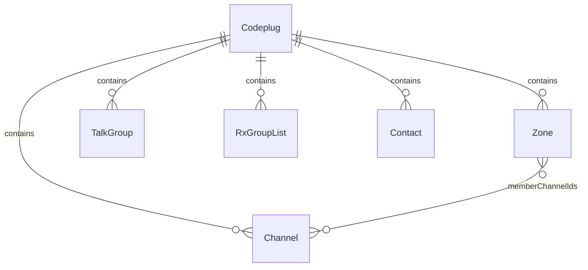
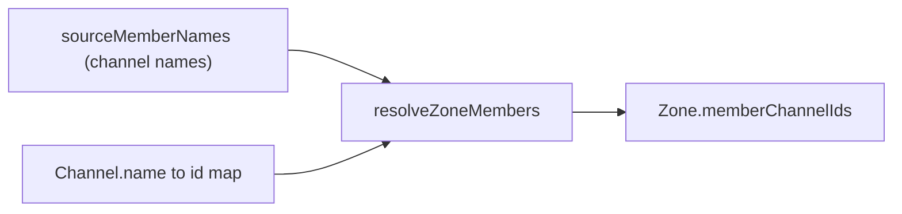

# Internal data model

Canonical reference for the vendor-neutral **codeplug** models used across tools. Import and export docs describe ETL at the format boundary; this document describes **what the models are**.

**Tracking:** [codeplug-tool#7](https://github.com/pskillen/codeplug-tool/issues/7) · OpenGD77 population [#38](https://github.com/pskillen/codeplug-tool/issues/38)

## Overview

A **codeplug** is the in-memory working set for one CPS layout: channels, zones, talk groups, RX group lists, and contacts. Tools consume these models — not raw CSV.

For **switchable, named containers** that hold one codeplug each (multi-project workflow), see [codeplug-project/](../codeplug-project/).

Some relationships are still **name-based** — a **transitional** foreign key, not the target design. `Channel.contactName` and `Channel.rxGroupListName` reference a talk group/contact and an RX group list by name; `RxGroupList.sourceMemberNames` lists member names (talk groups and/or contacts). The internal target is a stable **UUID id** FK; name resolution is carried only until the FK-by-id conversion (epic [#93](https://github.com/pskillen/codeplug-tool/issues/93) Phase 4). Treat name FKs as legacy wire baggage, not a pattern to extend.

Wire-format column detail (which format column maps to which field) lives in the relevant **format reference** (e.g. [OpenGD77](../../reference/opengd77/README.md)) and [import/export](../import-export/README.md) — not here. Radio-specific limits (zone member caps, feature availability) are format/profile concerns that apply at export time, not in the internal model.

**Source:** [`src/models/codeplug.ts`](../../../src/models/codeplug.ts) · schema version **4**

## Design principles

| Principle | Detail |
| --- | --- |
| **Radio-agnostic models** | Channels, zones, contacts, etc. have no radio hardware fields. Target radio constraints are applied at export (see [radio profiles](../../reference/opengd77/radios/README.md)). |
| **Stable internal ids** | Every entity has `id: string` (`crypto.randomUUID()` via `newId()`). Zone→channel uses resolved ids; FK-by-id is the target for all relationships. |
| **Names are display fields, not FKs** | `Channel.name`, `Zone.name`, etc. are preserved for UI and round-trip but are **not** the intended foreign-key mechanism. The remaining name-based FKs (above) are transitional and convert to ids in epic [#93](https://github.com/pskillen/codeplug-tool/issues/93) Phase 4. |
| **Name matching at import only** | Zone members resolve channel **names** → ids via `resolveZoneMembers`. Remaining `*Name` / `sourceMemberNames` fields hold imported names until id-resolution; do not introduce new name-keyed relationships. |
| **JSON-serialisable** | Plain data objects for persistence and export. |
| **Schema versioned** | `CODEPLUG_SCHEMA_VERSION = 4`; v1–v3 codeplugs migrate on load. |
| **CRUD is vendor-neutral** | Create/edit/delete in the SPA does not enforce radio cardinality (e.g. RX group list member count). Limits apply at import/export per [radio profiles](../../reference/opengd77/radios/README.md). |
| **Vendor-specific fields are additive** | e.g. `vendorExtras`, opaque wire strings — store when useful; importer/exporter decides drop, warn, truncate, or round-trip. Do not reject or cap in CRUD because export might not round-trip. |

## Entities

### `Codeplug`

| Field | Type | Notes |
| --- | --- | --- |
| `channels` | `Channel[]` | |
| `zones` | `Zone[]` | |
| `talkGroups` | `TalkGroup[]` | DMR group calls |
| `rxGroupLists` | `RxGroupList[]` | Promiscuous RX (receive) group lists |
| `contacts` | `Contact[]` | DMR private calls |
| `meta` | `CodeplugMeta` | Import metadata |

### `Channel`

| Field | Type | Notes |
| --- | --- | --- |
| `id` | `string` | Internal |
| `name` | `string` | Display name; currently also the resolution key for zone members (transitional — see name-FK note) |
| `callsign` | `string` | Derived — first word of `name` |
| `mode` | `ChannelMode` | Specific mode — see [channel-modes reference](../../reference/channel-modes.md) (`fm`, `dmr`, `ysf`, …) |
| `rxFrequency`, `txFrequency` | `string` | |
| `contactName` | `string` | TX talk group/contact, by name (transitional name FK → id, Phase 4) |
| `rxGroupListName` | `string` | RX group list, by name (transitional name FK → id, Phase 4) |
| `location` | `GeoPoint \| null` | |
| `useLocation` | `boolean` | |
| `bandwidthKHz`, `colourCode`, `timeslot`, `dmrId` | `string` | DMR/FM extras |
| `rxTone`, `txTone`, `squelch`, `power`, `rxOnly` | `string` | |
| `aprsConfigName` | `string` | APRS config, by name |
| `voxEnabled` | `boolean` | VOX enabled |
| `transmitTimeout` | `string` | Transmit timeout |
| `scanSkip` | `boolean` | Exclude from scan |
| `hideFromMap` | `boolean` | Internal only — exclude from map plots |
| `vendorExtras` | `Record<string, string>` | Opaque vendor wire fields preserved for round-trip |

Channel numbering (a CPS slot index) is **not** stored — it is assigned at export per target format. Wire-column mappings for every field above live in the relevant format reference (e.g. [OpenGD77](../../reference/opengd77/README.md)).

### `Zone`

| Field | Type | Notes |
| --- | --- | --- |
| `id` | `string` | Internal |
| `name` | `string` | |
| `memberChannelIds` | `string[]` | Resolved channel ids — authoritative membership |
| `sourceMemberNames` | `string[]` | Original imported member names (channel names) for re-resolution, unresolved reporting, and export round-trip |

### `TalkGroup`

DMR group call.

| Field | Type |
| --- | --- |
| `id`, `name`, `number`, `timeslotOverride` | (`number` is the DMR ID) |

### `Contact`

DMR private call.

| Field | Type |
| --- | --- |
| `id`, `name`, `number`, `timeslotOverride` | (`number` is the DMR ID) |

### `RxGroupList`

Named RX (receive) group list driving promiscuous receive. Members are currently referenced **by name** (talk groups and/or private contacts) — transitional, converting to id FKs in epic [#93](https://github.com/pskillen/codeplug-tool/issues/93) Phase 4. Many-to-many: one list has many members; one member can appear on many lists.

| Field | Type |
| --- | --- |
| `id`, `name` | |
| `sourceMemberNames` | `string[]` — original imported member names |

### `CodeplugMeta`

| Field | Type | Notes |
| --- | --- | --- |
| `schemaVersion` | `number` | Must match `CODEPLUG_SCHEMA_VERSION` (4) after migration |
| `importedAt` | `string \| null` | |
| `sourceFiles` | `string[]` | |

## Relationship resolution

## Related

- [Vendor-agnostic review](vendor-agnostic-review.md) — audit and required changes (#91 / #52 / #53)
- [OpenGD77 wire reference](../../reference/opengd77/README.md)
- [OpenGD77 radio profiles](../../reference/opengd77/radios/README.md)
- [Import / export](../import-export/README.md)
- [Map — channels](../map/channels.md)
- [Map — zones](../map/zones.md)
