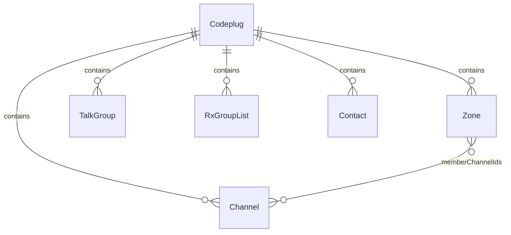
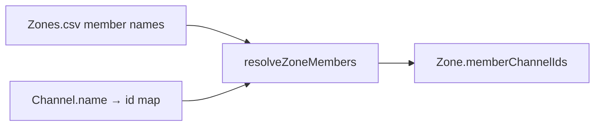

# Internal data model

Canonical reference for the vendor-neutral **codeplug** models used across tools. Import and export docs describe ETL at the format boundary; this document describes **what the models are**.

**Tracking:** [codeplug-tool#7](https://github.com/pskillen/codeplug-tool/issues/7) · OpenGD77 population [#38](https://github.com/pskillen/codeplug-tool/issues/38)

## Overview

A **codeplug** is the in-memory working set for one CPS layout: channels, zones, talk groups, RX group lists, and contacts. Tools consume these models — not raw CSV.

For **switchable, named containers** that hold one codeplug each (multi-project workflow), see [codeplug-project/](../codeplug-project/).

At the **vendor boundary**, `Channel.contactName` and `Channel.rxGroupListName` reference Contacts.csv / TG_Lists.csv **by name** (not internal id). `RxGroupList.sourceMemberNames` lists member names from Contacts.csv (group talk groups and/or private contacts).

**Source:** [`src/models/codeplug.ts`](../../../src/models/codeplug.ts) · schema version **2**

## Design principles

| Principle | Detail |
| --- | --- |
| **Stable internal ids** | Every entity has `id: string` (`crypto.randomUUID()` via `newId()`). Zone→channel uses resolved ids. |
| **Vendor names are display fields** | `Channel.name`, `Zone.name`, etc. are preserved for UI and export round-trip but are **not** internal foreign keys (except name-based wire fields below). |
| **Name matching at import only** | Zone members resolve channel **names** → ids via `resolveZoneMembers`. RX group list members stay as `sourceMemberNames` for export. |
| **JSON-serialisable** | Plain data objects for persistence and export. |
| **Schema versioned** | `CODEPLUG_SCHEMA_VERSION = 2`; v1 codeplugs migrate on load. |

## Entities

### `Codeplug`

| Field | Type | Notes |
| --- | --- | --- |
| `channels` | `Channel[]` | |
| `zones` | `Zone[]` | |
| `talkGroups` | `TalkGroup[]` | From Contacts.csv where `ID Type=Group` |
| `rxGroupLists` | `RxGroupList[]` | From `TG_Lists.csv` |
| `contacts` | `Contact[]` | From Contacts.csv where `ID Type=Private` |
| `meta` | `CodeplugMeta` | Import metadata |

### `Channel`

| Field | Type | Notes |
| --- | --- | --- |
| `id` | `string` | Internal |
| `name` | `string` | OpenGD77 `Channel Name` |
| `callsign` | `string` | Derived — first word of `name` |
| `mode` | `'analogue' \| 'digital' \| 'other'` | From `Channel Type` |
| `rxFrequency`, `txFrequency` | `string` | |
| `contactName` | `string` | Vendor `Contact` name |
| `rxGroupListName` | `string` | Vendor `TG List` — RX group list name |
| `location` | `GeoPoint \| null` | |
| `useLocation` | `boolean` | |
| `number` | `string` | |
| `bandwidthKHz`, `colourCode`, `timeslot`, `dmrId` | `string` | DMR/FM extras |
| `rxTone`, `txTone`, `squelch`, `power`, `rxOnly` | `string` | |
| `aprsConfigName` | `string` | OpenGD77 `APRS` column |
| `voxEnabled` | `boolean` | From `VOX` |
| `transmitTimeout` | `string` | From `TOT` |
| `scanSkip` | `boolean` | From `All Skip` |
| `vendorExtras` | `Record<string, string>` | Remaining OpenGD77-only columns |

### `Zone`

| Field | Type | Notes |
| --- | --- | --- |
| `id` | `string` | Internal |
| `name` | `string` | |
| `memberChannelIds` | `string[]` | Resolved channel ids |
| `sourceMemberNames` | `string[]` | `Channel1`…`Channel80` wire names |

### `TalkGroup`

DMR group call ID from Contacts.csv (`ID Type=Group`).

| Field | Type |
| --- | --- |
| `id`, `name`, `number`, `timeslotOverride` | |

### `Contact`

DMR private call from Contacts.csv (`ID Type=Private`).

| Field | Type |
| --- | --- |
| `id`, `name`, `number`, `timeslotOverride` | |

### `RxGroupList`

Named RX group list from `TG_Lists.csv`. Members are **vendor names** (may be talk groups or private contacts). Many-to-many at the vendor boundary: one list has many members; one name can appear on many lists.

| Field | Type |
| --- | --- |
| `id`, `name` | |
| `sourceMemberNames` | `string[]` — `Contact1`…`Contact32` |

### `CodeplugMeta`

| Field | Type | Notes |
| --- | --- | --- |
| `schemaVersion` | `number` | Must match `CODEPLUG_SCHEMA_VERSION` (2) after migration |
| `importedAt` | `string \| null` | |
| `sourceFiles` | `string[]` | |

## Relationship resolution

## Related

- [Import (ETL)](../import/README.md)
- [Export](../export/README.md)
- [Map — channels](../map/channels.md)
- [Map — zones](../map/zones.md)
