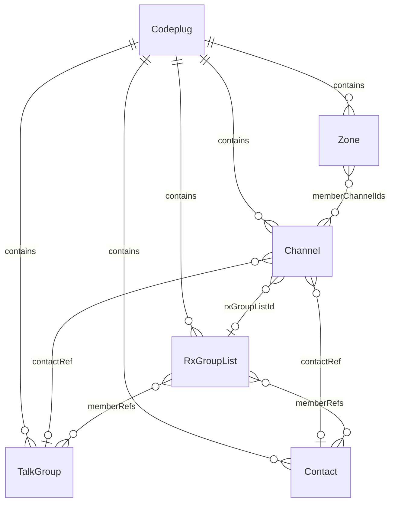
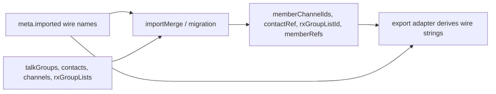

# Internal data model

Canonical reference for the vendor-neutral **codeplug** models used across tools. Import and export docs describe ETL at the format boundary; this document describes **what the models are**.

**Tracking:** [codeplug-tool#7](https://github.com/pskillen/codeplug-tool/issues/7) · OpenGD77 population [#38](https://github.com/pskillen/codeplug-tool/issues/38)

## Overview

A **codeplug** is the in-memory working set for one CPS layout: channels, zones, talk groups, RX group lists, and contacts. Tools consume these models — not raw CSV.

For **switchable, named containers** that hold one codeplug each (multi-project workflow), see [codeplug-project/](../codeplug-project/).

Internal relationships use **UUID id** foreign keys. `EntityRef` is a discriminated ref `{ kind: 'talkGroup' | 'contact'; id }` for dual-kind targets (channel TX contact, RX group list members). Wire names from CPS imports live in per-entity import provenance (`meta.imported`) and are resolved to ids at import/merge; export adapters derive wire strings from ids (with provenance fallback for round-trip fidelity). See [import/export](../import-export/README.md) for format-specific column mapping.

**Exception (transitional):** `Channel.aprsConfigName` remains a string FK until APRS/DTMF entities are modelled.

Wire-format mapping lives in the [import/export hub](../import-export/README.md) and per-format references under `docs/reference/<format>/` — not here. Radio-specific limits (zone member caps, feature availability) are format/profile concerns that apply at export time, not in the internal model.

**Source:** [`src/models/codeplug.ts`](../../../src/models/codeplug.ts) · schema version **7**

## Design principles

| Principle | Detail |
| --- | --- |
| **Radio-agnostic models** | Channels, zones, contacts, etc. have no radio hardware fields. Target radio constraints are applied at export (see [radio profiles](../../reference/opengd77/radios/README.md)). |
| **Stable internal ids** | Every entity has `id: string` (`crypto.randomUUID()` via `newId()`). Relationships use id FKs: `Zone.memberChannelIds`, `Channel.contactRef`, `Channel.rxGroupListId`, `RxGroupList.memberRefs`. |
| **Names are display fields, not FKs** | `Channel.name`, `Zone.name`, etc. are preserved for UI and export labels. `TalkGroup.name` / `Contact.name` uniqueness is a project invariant, not an FK mechanism. |
| **Wire names at import/export only** | Zone and RGL member wire names, channel contact/RGL wire strings live in `meta.imported` provenance. Resolved to ids in `importMerge` / migration; export adapters derive wire strings from ids. |
| **JSON-serialisable** | Plain data objects for persistence and export. |
| **Schema versioned** | `CODEPLUG_SCHEMA_VERSION = 7`; v1–v6 codeplugs migrate on load. |
| **CRUD is vendor-neutral** | Create/edit/delete in the SPA does not enforce radio cardinality (e.g. RX group list member count). Limits apply at import/export per [radio profiles](../../reference/opengd77/radios/README.md). |
| **Vendor-specific fields are additive** | e.g. `opengd77Extras`, import provenance in `meta.imported` — store when useful; importer/exporter decides drop, warn, truncate, or round-trip. Do not reject or cap in CRUD because export might not round-trip. |

## Entities

### `Codeplug`

| Field | Type | Notes |
| --- | --- | --- |
| `channels` | `Channel[]` | |
| `zones` | `Zone[]` | |
| `talkGroups` | `TalkGroup[]` | DMR group calls |
| `rxGroupLists` | `RxGroupList[]` | Promiscuous RX (receive) group lists |
| `contacts` | `Contact[]` | DMR private calls |
| `meta` | `CodeplugMeta` | Import metadata |

### `Channel`

Typed scalar fields use vendor-neutral semantics in the model; CPS wire strings are converted at the import/export boundary (see [import/export](../import-export/README.md)).

| Field | Type | Notes |
| --- | --- | --- |
| `id` | `string` | Internal |
| `name` | `string` | Display name; currently also the resolution key for zone members (transitional — see name-FK note) |
| `callsign` | `string` | Derived — first word of `name` |
| `mode` | `ChannelMode` | Specific mode — see [channel-modes reference](../../reference/channel-modes.md) (`fm`, `dmr`, `ysf`, …) |
| `rxFrequency`, `txFrequency` | `number \| null` | Integer **Hz**; `null` when unset |
| `contactRef` | `EntityRef \| null` | TX talk group or private contact, by id |
| `rxGroupListId` | `string \| null` | RX group list id |
| `location` | `GeoPoint \| null` | |
| `useLocation` | `boolean` | |
| `bandwidthKHz` | `number \| null` | kHz (e.g. `12.5`, `25`); `null` when unset |
| `colourCode` | `number \| null` | DMR colour code 0–15; `null` when not applicable |
| `timeslot` | `1 \| 2 \| null` | DMR timeslot; `null` when not applicable |
| `dmrId` | `number \| null` | Hotspot/repeater ID override; `null` when unset |
| `rxTone`, `txTone` | `ChannelTone` | CTCSS/DCS value or `'none'` |
| `squelch` | `number \| null` | Percent 0–100; `0` = open/off; `null` = radio default |
| `power` | `number \| null` | Percent 0–100; `null` = radio default |
| `rxOnly` | `boolean` | Receive-only channel |
| `aprsConfigName` | `string` | APRS config, by name |
| `voxEnabled` | `boolean` | VOX enabled |
| `transmitTimeout` | `number \| null` | Seconds; `0` = off; `null` when unset |
| `scanSkip` | `boolean` | Exclude from scan |
| `hideFromMap` | `boolean` | Internal only — exclude from map plots |
| `opengd77Extras` | `Record<string, string>` | OpenGD77-only opaque wire columns preserved for round-trip |
| `meta` | `EntityMeta` | Optional per-entity metadata (see below) |

Channel numbering (a CPS slot index) is **not** stored — it is assigned at export per target format.

### `Zone`

| Field | Type | Notes |
| --- | --- | --- |
| `id` | `string` | Internal |
| `name` | `string` | |
| `memberChannelIds` | `string[]` | Resolved channel ids — authoritative membership |
| `meta` | `EntityMeta` | Optional; `meta.imported.memberWireNames` holds imported zone member channel names |

### `TalkGroup`

DMR group call.

| Field | Type | Notes |
| --- | --- | --- |
| `id`, `name`, `number`, `timeslotOverride` | | (`number` is the DMR ID) |
| `meta` | `EntityMeta` | Optional import provenance |

### `Contact`

DMR private call.

| Field | Type | Notes |
| --- | --- | --- |
| `id`, `name`, `number`, `timeslotOverride` | | (`number` is the DMR ID) |
| `meta` | `EntityMeta` | Optional import provenance |

### `RxGroupList`

Named RX (receive) group list driving promiscuous receive. Members are ordered `EntityRef[]` ids (talk groups and/or private contacts). Many-to-many: one list has many members; one member can appear on many lists.

| Field | Type | Notes |
| --- | --- | --- |
| `id`, `name` | | |
| `memberRefs` | `EntityRef[]` | Ordered membership by id |
| `meta` | `EntityMeta` | `meta.imported.memberWireNames` for export round-trip |

### `CodeplugMeta`

| Field | Type | Notes |
| --- | --- | --- |
| `schemaVersion` | `number` | Must match `CODEPLUG_SCHEMA_VERSION` (7) after migration |
| `importedAt` | `string \| null` | |
| `sourceFiles` | `string[]` | |

### `EntityMeta` / `ImportedProvenance`

Per-entity import provenance — accessors in [`src/lib/entityProvenance.ts`](../../../src/lib/entityProvenance.ts).

| Field | Type | Notes |
| --- | --- | --- |
| `meta.imported.formatId` | `string` | Source format (e.g. `'opengd77'`) |
| `meta.imported.sourceFile` | `string \| null` | Source CSV filename when known |
| `meta.imported.importedAt` | `string` | ISO-8601 timestamp |
| `meta.imported.memberWireNames` | `string[]` | Ordered wire names for zone/RGL list members |
| `meta.imported.contactWireName` | `string` | Channel TX contact wire string (channels only) |
| `meta.imported.rxGroupListWireName` | `string` | Channel RX list wire string (channels only) |

### `EntityRef`

Discriminated ref for dual-kind targets (talk group or private contact):

| Field | Type |
| --- | --- |
| `kind` | `'talkGroup' \| 'contact'` |
| `id` | `string` — entity UUID |

Helpers: [`src/lib/entityRefs.ts`](../../../src/lib/entityRefs.ts) — resolve wire names at import, derive wire strings at export, display labels in UI.

Project-level `CodeplugMeta.importedAt` / `sourceFiles` remain for dashboard and merge bookkeeping.

## Relationship resolution

## Related

- [Vendor-agnostic review](vendor-agnostic-review.md) — audit and required changes (#91 / #52 / #53)
- [Import / export](../import-export/README.md)
- [Map — channels](../map/channels.md)
- [Map — zones](../map/zones.md)
