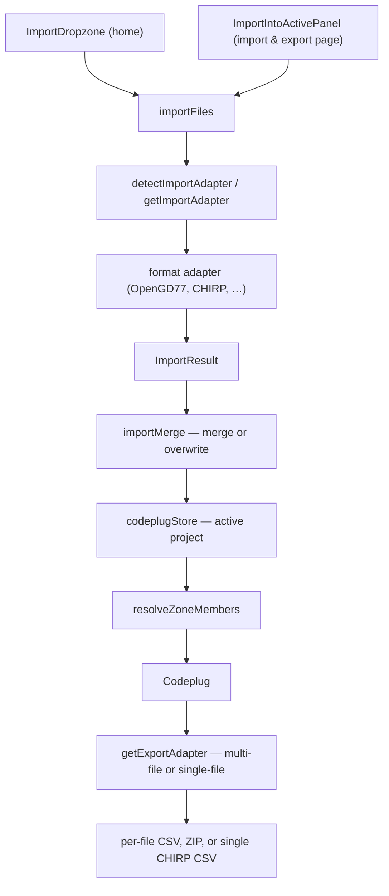

# Import / export

How CPS export files enter the app, become internal [codeplug models](../data-model/README.md), and leave again as vendor formats.

**Tracking:** [codeplug-tool#7](https://github.com/pskillen/codeplug-tool/issues/7) (import foundation), [#38](https://github.com/pskillen/codeplug-tool/issues/38) (OpenGD77 full I/O), [#58](https://github.com/pskillen/codeplug-tool/issues/58) (active import), [#84](https://github.com/pskillen/codeplug-tool/issues/84) (doc collate), [#103](https://github.com/pskillen/codeplug-tool/issues/103) (CHIRP)

Operator workflow (create → edit → persist → export to multiple formats): [operator lifecycle](../workflows/operator-lifecycle.md).

## Problem

Import was originally hard-wired to OpenGD77 CSV inside the channel map. The app now has a format registry, OpenGD77 as the first adapter pair, and a central store that resolves vendor names to internal ids. Export serialises the internal models back to a format the vendor CPS accepts.

The internal model is **format- and radio-agnostic**. Format specifics — column mapping, cardinality caps, skipped files — apply at the **import/export boundary** only.

**Formats vs variants.** OpenGD77 CSV is **one** import/export format, sibling to Baofeng DM32 CSV, qDMR YAML, native YAML, and analogue-only formats like CHIRP (DM32 and CHIRP are unrelated to OpenGD77). *Within* the OpenGD77 format there are per-radio **variants** (1701, MD9600, GD-77, …). Variant-specific limits are documented in [OpenGD77 radio profiles](../../reference/opengd77/radios/README.md) and are intended to be applied when the operator picks a target OpenGD77 radio at export time ([#72](https://github.com/pskillen/codeplug-tool/issues/72) — OpenGD77-only; not cross-format work).

## Implementation status

| Area | Status | Notes |
| --- | --- | --- |
| Internal models | Shipped | [`src/models/codeplug.ts`](../../../src/models/codeplug.ts) — schema v12 |
| Adapter interface contracts | Shipped | [`src/lib/import-export/`](../../../src/lib/import-export/) — `ImportAdapter`, `ExportAdapter` |
| Export format registry | Shipped | [`src/lib/export/`](../../../src/lib/export/) |
| OpenGD77 import | Shipped | Channels, Zones, Contacts, TG_Lists ([#38](https://github.com/pskillen/codeplug-tool/issues/38)) |
| OpenGD77 export | Shipped | Per-file + ZIP; DTMF/APRS header-only |
| Multi-file + directory import UI | Shipped | [`ImportDropzone`](../../../src/components/ImportDropzone/ImportDropzone.tsx) on home |
| Active project import | Shipped | [`ImportIntoActivePanel`](../../../src/components/ImportIntoActivePanel/ImportIntoActivePanel.tsx) on Import & export ([#58](https://github.com/pskillen/codeplug-tool/issues/58)) |
| Merge / overwrite modes | Shipped | [`importMerge.ts`](../../../src/lib/importMerge.ts) — idempotent merge by vendor name |
| Name → id resolution | Shipped | Store + [`src/lib/codeplug.ts`](../../../src/lib/codeplug.ts) |
| Export page (`/export`) | Shipped | Nav link when a project is active |
| Delivery-aware export UI | Shipped | Registry dispatch + CHIRP profile picker ([#103](https://github.com/pskillen/codeplug-tool/issues/103)) |
| LocalStorage persistence | Shipped | [#9](https://github.com/pskillen/codeplug-tool/issues/9) — [persistence/](../persistence/) |
| Multi-project import | Shipped | Home creates project; Import & export merges into active — [codeplug-project/](../codeplug-project/) |
| OpenGD77 radio-variant picker | Planned | Apply per-radio (1701, MD9600, …) limits within OpenGD77 export — [#72](https://github.com/pskillen/codeplug-tool/issues/72); OpenGD77-only, not cross-format |
| qDMR YAML | Deferred | [#37](https://github.com/pskillen/codeplug-tool/issues/37) — UI placeholder |
| Native YAML | Deferred | [#10](https://github.com/pskillen/codeplug-tool/issues/10) — UI placeholder |
| Baofeng DM32 CPS | Shipped | [#67](https://github.com/pskillen/codeplug-tool/issues/67) — [dm32/](dm32/README.md); `expandModes: false`, RX list fan-out |
| Multi-talkgroup expansion (shared lib) | Shipped | [#36](https://github.com/pskillen/codeplug-tool/issues/36) — `channelExpansion/`; OpenGD77 export unchanged |
| CHIRP CSV (analogue FM/AM) | Shipped | [#103](https://github.com/pskillen/codeplug-tool/issues/103) — [chirp/](chirp/README.md) |
| Channel wire name split + export composition | Shipped | [#54](https://github.com/pskillen/codeplug-tool/issues/54) — [channel-name-parsing.md](channel-name-parsing.md) |

## Documentation map

| Doc | Contents |
| --- | --- |
| [channel-name-parsing.md](channel-name-parsing.md) | CPS wire name → `callsign` + `name` split ([#54](https://github.com/pskillen/codeplug-tool/issues/54)) |
| [data-model/README.md](../data-model/README.md) | Entity definitions (canonical, vendor-neutral) |
| [opengd77/README.md](opengd77/README.md) | OpenGD77 adapter behaviour; columns in [reference/opengd77/](../../reference/opengd77/README.md) |
| [adding-a-new-vendor.md](adding-a-new-vendor.md) | Contributor checklist for new formats |
| [format-taxonomy.md](format-taxonomy.md) | Formats vs variants mental model + data-model findings (planning input) |
| [outstanding.md](outstanding.md) | Collated open debt |
| [opengd77/progress.md](opengd77/progress.md) | OpenGD77 execution log |
| [dm32/README.md](dm32/README.md) | DM32 adapter behaviour ([#67](https://github.com/pskillen/codeplug-tool/issues/67)) |
| [chirp/README.md](chirp/README.md) | CHIRP adapter behaviour ([#103](https://github.com/pskillen/codeplug-tool/issues/103)) |
| [operator-lifecycle.md](../workflows/operator-lifecycle.md) | Multi-format operator workflow |
| [Testing strategy](../../build/testing/README.md) | Format fidelity, layers, CI |
| [persistence/README.md](../persistence/README.md) | LocalStorage envelope |
| [codeplug-project/README.md](../codeplug-project/README.md) | Project wrapper + CRUD |

## Architecture



All vendor formats convert through the radio-agnostic internal model. Import adapters parse vendor files into entities; export adapters serialise entities back to vendor columns. Feature code (map, CRUD, store) works on the internal model only.

### Channel expansion (multi-mode / multi-talkgroup)

Shared logic in [`src/lib/channelExpansion/`](../../../src/lib/channelExpansion/) — adapters call `expandAllChannelsForExport` before serialising wire rows:

| Axis | When to enable | OpenGD77 |
| --- | --- | --- |
| Multi-mode | Format has no native dual-mode row | Always (separate Analogue/Digital rows) |
| Multi-talkgroup | Format has **no native RX group lists** | **Never** — lean export with `TG List` |

Pass `ExportOptions.expandRxGroupLists` and `expandRxGroupListMembers` through `expandOptionsFromExport()` ([`exportOptions.ts`](../../../src/lib/channelExpansion/exportOptions.ts)). Zone export uses `expandZoneMemberWireNames` with the same flags.

Domain rules: [multi-talkgroup-expansion.md](../../reference/multi-talkgroup-expansion.md). DM32 ([#67](https://github.com/pskillen/codeplug-tool/issues/67)) will enable TG expansion on export.

## Import modes ([#58](https://github.com/pskillen/codeplug-tool/issues/58))

Only entity types **present** in the import batch are touched.

| Mode | Behaviour |
| --- | --- |
| **Merge** (default) | Match by vendor name (case-sensitive). Update rows only when imported fields differ; append new names; preserve internal ids and app-only fields (`hideFromMap`). Re-importing an unchanged file is a no-op. |
| **Overwrite** | Replace the entire array for each imported file type (e.g. all channels when `Channels.csv` is included). |

### Merge matching keys

| Entity | Match key |
| --- | --- |
| Channel | `Channel Name` |
| Zone | `Zone Name` |
| Contact / talk group | `Contact Name` |
| RX group list | `TG List Name` |

After apply, all zones' `memberChannelIds` are re-resolved from `meta.imported.memberWireNames`. Unresolved member names appear in the confirm modal and import report.

## OpenGD77 export

- **Per-file download:** `Channels.csv`, `Zones.csv`, `Contacts.csv`, `TG_Lists.csv`
- **ZIP:** all six CPS files; `DTMF.csv` and `APRS.csv` are header-only (not modelled)
- **Route:** `/#/export` when a codeplug project is active

OpenGD77 CPS CSV is **one interchange format shared by many radios**. Import/export adapters are format-level; radio-specific limits are profile-level at export time.

Code: [`src/lib/export/opengd77/`](../../../src/lib/export/opengd77/), UI [`src/routes/ImportExport.tsx`](../../../src/routes/ImportExport.tsx)

## Wire format reference

| CPS file | Reference |
| --- | --- |
| All files — cross-cutting rules | [file-format.md](../../reference/opengd77/file-format.md) |
| `Channels.csv` | [channels.md](../../reference/opengd77/channels.md) |
| `Zones.csv` | [zones.md](../../reference/opengd77/zones.md) |
| `Contacts.csv` | [contacts.md](../../reference/opengd77/contacts.md) |
| `TG_Lists.csv` | [tg-lists.md](../../reference/opengd77/tg-lists.md) |
| `DTMF.csv` / `APRS.csv` | [dtmf-aprs.md](../../reference/opengd77/dtmf-aprs.md) |

Authoritative column and conversion reference: [reference/opengd77/](../../reference/opengd77/README.md). Per-radio limits: [radio profiles](../../reference/opengd77/radios/README.md).

## Code anchors

| Symbol | File | Role |
| --- | --- | --- |
| `importFiles` | `src/lib/import/index.ts` | Read files, route by adapter, classify, parse |
| `getImportAdapter` / `getExportAdapter` | `src/lib/import-export/registry.ts` | Format registry |
| `previewImportMerge` / `applyImportToCodeplug` | `src/lib/importMerge.ts` | Merge/overwrite + stats |
| `channelsImportEqual` | `src/lib/importEntityCompare.ts` | Idempotent field compare |
| `opengd77Adapter` | `src/lib/import/opengd77/adapter.ts` | `detectKind`, delegates to parse |
| `parseChannels` / `parseZones` | `src/lib/import/opengd77/parse.ts` | CSV → models / raw zones |
| `exportCodeplug` | `src/lib/export/index.ts` | Serialise to vendor format |
| `CodeplugProvider` | `src/state/codeplugStore.tsx` | Central state + `applyImportToActive` |
| `runActiveImportWorkflow` | `src/test/system/importWorkflow.ts` | System test harness |

## Import UI behaviour

- **Home:** `ImportDropzone` creates a **new** codeplug project (`importNewProject`).
- **Import & export (`/export`):** `ImportIntoActivePanel` merges into the **active** project with confirm modal (`applyImportToActive`).
- **Drop target:** multiple `.csv` files or a whole folder.
- **New project naming** (Home import only): folder selection → leaf directory name; loose files (one or many) → `{adapter projectNameLabel} YYYY-MM-DD` (ISO date). Each import adapter sets `projectNameLabel` — see per-format docs (e.g. [OpenGD77](opengd77/README.md#new-project-naming)). See also [codeplug-project](../codeplug-project/README.md).
- **Recognised (OpenGD77):** `Channels.csv`, `Zones.csv`, `Contacts.csv`, `TG_Lists.csv`
- **Skipped (OpenGD77):** `DTMF.csv`, `APRS.csv`, other unknown CSVs when OpenGD77 files are present
- **CHIRP:** single memory CSV with standard 21-column header fingerprint

## Automated tests

```bash
npm run test              # unit tests including importMerge, round-trip
npm run test:system       # workflow harness + ImportIntoActivePanel UI flow
```

Synthetic CSV bundles: [`src/test/opengd77/bundles.ts`](../../../src/test/opengd77/bundles.ts).

Format fidelity strategy: [format-fidelity.md](../../build/testing/format-fidelity.md).

## Manual verify

### Merge workflow

1. `npm run dev` → Home → import a supported CPS export (folder or loose files) → Summary opens with new project named from the folder leaf or `{adapter projectNameLabel} YYYY-MM-DD`.
2. Import & export → **Merge** → import `Zones.csv` → confirm shows zones added → zones resolve on `/zones`.
3. Re-import **identical** `Channels.csv` → confirm shows all unchanged.
4. Re-import **modified** `Channels.csv` → only changed rows updated; zone links intact.
5. Import `Contacts.csv` / `TG_Lists.csv` alone → other entities unchanged.

### Overwrite workflow

1. With a populated codeplug, Import & export → **Overwrite** → import smaller `Channels.csv` → confirm warns removed count.
2. Overwrite `Zones.csv` only → channels/contacts unchanged.

### Export workflow

1. With a populated codeplug, `/#/export` → download per-file CSVs or ZIP.
2. Re-import exported files → merge shows unchanged (same-format round-trip).

### Regression

1. Home → import second codeplug → still creates new project.
2. Hard refresh → data persists from LocalStorage.

## History

- **#7** — Genericise import: internal models, format registry, central store, home import UI.
- **#38** — OpenGD77 full import/export: extended channel model, Contacts/TG lists, export serialisers, round-trip test.
- **#58** — Active project import: merge/overwrite modes, `ImportIntoActivePanel`, system test harness.

## Related

- [OpenGD77 adapter](opengd77/README.md)
- [Adding a new vendor](adding-a-new-vendor.md)
- [Data model](../data-model/README.md)
- [Map hub](../map/README.md)
