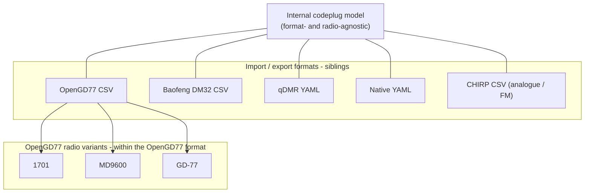

# Formats, variants, and the vendor-neutral model

**Purpose:** the target mental model for import/export, plus an audit of where the docs and model still over-centre OpenGD77. This is **planning input** — it feeds the data-model epic and the field-rationalisation work in [#52](https://github.com/pskillen/codeplug-tool/issues/52) and [#53](https://github.com/pskillen/codeplug-tool/issues/53). It is intentionally point-in-time (Jun 2026); fold conclusions into the canonical docs as the work lands.

---

## TL;DR mental model

The internal [codeplug model](../data-model/README.md) is the **format- and radio-agnostic hub**. Everything vendor-specific lives at the import/export boundary.

Three levels, kept distinct:

| Concept | Definition | Examples |
| --- | --- | --- |
| **Internal model** | Vendor-neutral entities; the single source of truth | `Channel`, `Zone`, `TalkGroup`, `RxGroupList`, `Contact` |
| **Format** | A wire interchange format an adapter reads/writes at the boundary | OpenGD77 CSV, DM32 CSV, qDMR YAML, native YAML, CHIRP CSV |
| **Variant** (a.k.a. radio profile) | A per-radio specialisation *within one format*, applied at export | OpenGD77-1701, OpenGD77-MD9600, GD-77 |

**Key corrections to watch for:**

- OpenGD77 CSV is **one** format, not *the* format. It is just the first one shipped.
- **DM32 and CHIRP are sibling formats** — they have nothing to do with OpenGD77. DM32 is a different CSV; CHIRP is analogue/FM, not even DMR.
- Per-radio **profiles (1701, MD9600, …) are variants of the OpenGD77 format**, not separate formats and not generic export concepts.
- [#72](https://github.com/pskillen/codeplug-tool/issues/72) is **OpenGD77 radio-variant selection at export** — it is *not* cross-format genericisation. Picking the *format* is a separate, earlier choice.

---

## Why this matters now

The last epic before MVP is a full **import → modify → export → write-to-radio-via-CPS** loop for at least one radio. That requires nailing down the internal data model so it is genuinely format-neutral — otherwise OpenGD77 wire semantics leak into CRUD, persistence, and validation and block the second format (and the analogue case) later.

---

## Audit findings (Jun 2026)

A scan of all repository markdown found OpenGD77 framed as the default export concept in several places. Status below.

### Reframed in this PR ([#84](https://github.com/pskillen/codeplug-tool/issues/84))

| File | Change |
| --- | --- |
| [`README.md`](../../../README.md) | Roadmap + intro lead with format registry; OpenGD77 CSV "first, not special" |
| [`AGENTS.md`](../../../AGENTS.md) | "OpenGD77 CSV inputs" section reframed as one format with radio variants |
| [`import-export/README.md`](README.md) | Added "Formats vs variants" paragraph; relabelled status rows, diagram, and #72 |
| [`reference/opengd77/README.md`](../../reference/opengd77/README.md) | "one of the wire formats"; variants vs format clarified |
| [`import-export/opengd77/README.md`](opengd77/README.md) | "first shipped format" not "first target" |
| [`features/README.md`](../README.md) | Reference index notes per-format trees and a sibling-formats row |

Also fixed: relative links to the deleted `import/` and `export/` folders.

### Already correct (use as templates)

- [`adding-a-new-vendor.md`](adding-a-new-vendor.md) — explicit "new format vs new radio variant" table.
- [`dm32/README.md`](dm32/README.md) — DM32 as a separate format; OpenGD77 as reference *implementation* only.
- [`reference/opengd77/radios/README.md`](../../reference/opengd77/radios/README.md) and [`file-format.md`](../../reference/opengd77/file-format.md) — variant-at-export-time architecture.
- [`format-fidelity.md`](../../build/testing/format-fidelity.md) — FormatA/FormatB cross-format matrix.
- [`codeplug-project/README.md`](../codeplug-project/README.md) and [`TargetRadiosEditor.md`](../../../src/components/TargetRadiosEditor/TargetRadiosEditor.md) — project `targetRadios` are *not* export profiles.

### Remaining drift (lower priority — defer or fold into later work)

- `adding-a-new-vendor.md` filename and `<vendor>` slug conflate "vendor" with "format" (cosmetic).
- [`feature-docs SKILL`](../../../.cursor/skills/feature-docs/SKILL.md) "vendor subtrees (opengd77/, dm32/)" — prefer "format subtrees".
- [`map/README.md`](../map/README.md) and [`report/README.md`](../report/README.md) open as if the app *is* an OpenGD77 tool rather than internal-model-first.
- [`ImportIntoActivePanel.md`](../../../src/components/ImportIntoActivePanel/ImportIntoActivePanel.md) describes OpenGD77 import, though the component is already format-parametric (`vendorFormat` prop).

---

## Deeper data-model concerns (feed [#52](https://github.com/pskillen/codeplug-tool/issues/52) / [#53](https://github.com/pskillen/codeplug-tool/issues/53))

These are structural, not wording — the substance of the data-model epic.

1. **OpenGD77 wire values stored as untyped strings.** `power` (`P2`/`Master`), `bandwidthKHz`, `colourCode`, `timeslot`, `squelch`, tones are opaque vendor strings rather than typed neutral values. Translate at the boundary. → [#52](https://github.com/pskillen/codeplug-tool/issues/52).
2. **`Channel.number` is an OpenGD77 CPS concept** with no neutral meaning; should be assigned at export, not stored. → [#53](https://github.com/pskillen/codeplug-tool/issues/53).
3. **DMR-centric entity set presented as canonical.** Channels/zones/talk groups/RX group lists/contacts assume DMR. An **analogue-only format like CHIRP** would expose this: no talk groups, colour code, or timeslot; CTCSS/DCS tones become primary; "contacts" are meaningless. The model should treat DMR fields as *mode-applicable*, not universal (pairs with mode-enum work #45/#48).
4. **Open question for MVP scope.** The goal is *one radio nailed end-to-end*, not all formats generalised. Decide explicitly how far to push neutrality now (e.g. typed fields + drop `number`) vs. defer (full analogue support, multi-format export) until after the first complete loop.

---

## CHIRP as a litmus test

CHIRP is worth naming even though no adapter is planned soon: it is **analogue/FM, not DMR**, and is the cleanest test of whether the internal model is truly mode-neutral. Any design that "just works" for OpenGD77 and DM32 (both DMR) but breaks for CHIRP is still carrying DMR assumptions. Use it as a thought-experiment when rationalising fields.

---

## Related

- [Import / export hub](README.md)
- [Adding a new vendor format](adding-a-new-vendor.md)
- [Data model](../data-model/README.md)
- [Format fidelity](../../build/testing/format-fidelity.md)
- Issues: [#52](https://github.com/pskillen/codeplug-tool/issues/52) (typed fields), [#53](https://github.com/pskillen/codeplug-tool/issues/53) (drop channel number), [#72](https://github.com/pskillen/codeplug-tool/issues/72) (OpenGD77 variant picker), [#84](https://github.com/pskillen/codeplug-tool/issues/84) (doc collate)
