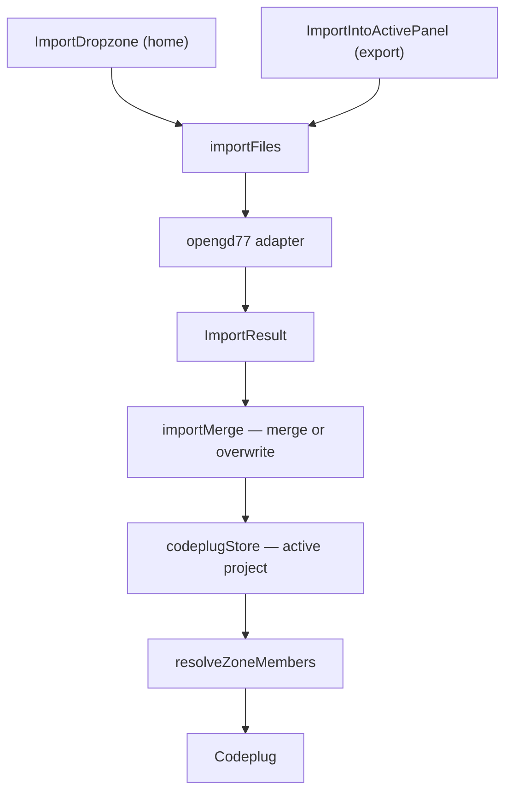

# Import

How CPS export files enter the app and become internal [codeplug models](../data-model/README.md).

**Tracking:** [codeplug-tool#7](https://github.com/pskillen/codeplug-tool/issues/7), active import [#58](https://github.com/pskillen/codeplug-tool/issues/58)

## Problem

Import was hard-wired to OpenGD77 CSV inside the channel map. This refactor introduces a format registry, OpenGD77 as the first adapter, and a central store that resolves vendor names to internal ids.

## Implementation status

| Area | Status | Notes |
| --- | --- | --- |
| Internal models | Shipped | [`src/models/codeplug.ts`](../../../src/models/codeplug.ts) — schema v3 |
| OpenGD77 adapter | Shipped | Channels, Zones, Contacts, TG_Lists ([#38](https://github.com/pskillen/codeplug-tool/issues/38)) |
| Format registry | Shipped | OpenGD77 only; room for more brands |
| Multi-file + directory import UI | Shipped | [`ImportDropzone`](../../../src/components/ImportDropzone/ImportDropzone.tsx) on home |
| Active project import | Shipped | [`ImportIntoActivePanel`](../../../src/components/ImportIntoActivePanel/ImportIntoActivePanel.tsx) on Export ([#58](https://github.com/pskillen/codeplug-tool/issues/58)) |
| Merge / overwrite modes | Shipped | [`importMerge.ts`](../../../src/lib/importMerge.ts) — idempotent merge by vendor name |
| Name → id resolution | Shipped | Store + [`src/lib/codeplug.ts`](../../../src/lib/codeplug.ts) |
| LocalStorage persistence | Shipped | [#9](https://github.com/pskillen/codeplug-tool/issues/9) — [persistence/](../persistence/) |
| Multi-project import | Shipped | Home creates project; Export merges into active — [codeplug-project/](../codeplug-project/) |

## Documentation map

| Doc | Contents |
| --- | --- |
| [data-model/README.md](../data-model/README.md) | Entity definitions (canonical) |
| [opengd77.md](opengd77.md) | OpenGD77 adapter behaviour; columns in [reference/opengd77/](../../reference/opengd77/README.md) |
| [active-import-progress.md](active-import-progress.md) | #58 execution log |
| [active-import-outstanding.md](active-import-outstanding.md) | #58 discovered debt |
| [opengd77-progress.md](opengd77-progress.md) | #38 execution log |
| [opengd77-outstanding.md](opengd77-outstanding.md) | #38 discovered debt |
| [export/README.md](../export/README.md) | CPS export |
| [persistence/README.md](../persistence/README.md) | LocalStorage envelope |
| [codeplug-project/README.md](../codeplug-project/README.md) | Project wrapper + CRUD |

## Architecture



## Import modes ([#58](https://github.com/pskillen/codeplug-tool/issues/58))

Only entity types **present** in the import batch are touched.

| Mode | Behaviour |
| --- | --- |
| **Merge** (default) | Match by vendor name (case-sensitive). Update rows only when imported fields differ; append new names; preserve internal ids and app-only fields (`hideFromMap`). Re-importing an unchanged file is a no-op. |
| **Overwrite** | Replace the entire array for each imported file type (e.g. all channels when `Channels.csv` is included). |

### Merge matching keys

| Entity | Match key |
| --- | --- |
| Channel | `Channel Name` |
| Zone | `Zone Name` |
| Contact / talk group | `Contact Name` |
| RX group list | `TG List Name` |

After apply, all zones' `memberChannelIds` are re-resolved from `sourceMemberNames`. Unresolved member names appear in the confirm modal and import report.

## Code anchors

| Symbol | File | Role |
| --- | --- | --- |
| `importFiles` | `src/lib/import/index.ts` | Read files, classify, parse |
| `previewImportMerge` / `applyImportToCodeplug` | `src/lib/importMerge.ts` | Merge/overwrite + stats |
| `channelsImportEqual` | `src/lib/importEntityCompare.ts` | Idempotent field compare |
| `opengd77Adapter` | `src/lib/import/opengd77/adapter.ts` | `detectKind`, delegates to parse |
| `parseChannels` / `parseZones` | `src/lib/import/opengd77/parse.ts` | CSV → models / raw zones |
| `CodeplugProvider` | `src/state/codeplugStore.tsx` | Central state + `applyImportToActive` |
| `runActiveImportWorkflow` | `src/test/system/importWorkflow.ts` | System test harness |

## Import UI behaviour

- **Home:** `ImportDropzone` creates a **new** codeplug project (`importNewProject`).
- **Export:** `ImportIntoActivePanel` merges into the **active** project with confirm modal (`applyImportToActive`).
- **Drop target:** multiple `.csv` files or a whole folder.
- **Recognised:** `Channels.csv`, `Zones.csv`, `Contacts.csv`, `TG_Lists.csv`
- **Skipped:** `DTMF.csv`, `APRS.csv`, other unknown CSVs

## Automated tests

```bash
npm run test              # unit tests including importMerge
npm run test:system       # workflow harness + ImportIntoActivePanel UI flow
```

Synthetic CSV bundles: [`src/test/opengd77/bundles.ts`](../../../src/test/opengd77/bundles.ts).

## Manual verify

### Merge workflow

1. `npm run dev` → Home → import `Channels.csv` → Summary opens with new project.
2. Export → **Merge** → import `Zones.csv` → confirm shows zones added → zones resolve on `/zones`.
3. Re-import **identical** `Channels.csv` → confirm shows all unchanged.
4. Re-import **modified** `Channels.csv` → only changed rows updated; zone links intact.
5. Import `Contacts.csv` / `TG_Lists.csv` alone → other entities unchanged.

### Overwrite workflow

1. With a populated codeplug, Export → **Overwrite** → import smaller `Channels.csv` → confirm warns removed count.
2. Overwrite `Zones.csv` only → channels/contacts unchanged.

### Regression

1. Home → import second codeplug → still creates new project.
2. Hard refresh → data persists from LocalStorage.

## Related

- [OpenGD77 adapter](opengd77.md)
- [Data model](../data-model/README.md)
- [Map hub](../map/README.md)
