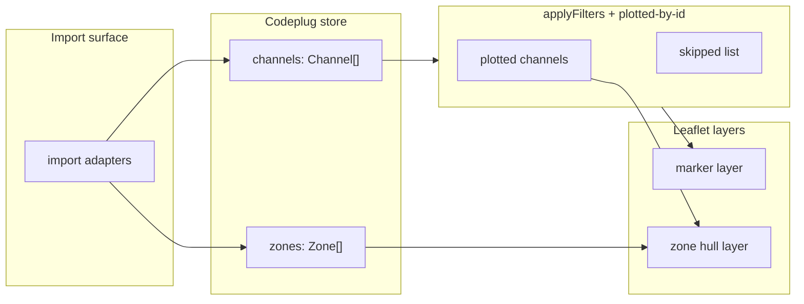

# Map tool

A codeplug carries latitude and longitude on each channel and lists zone membership separately, but vendor CPS gives no geographic overview. The map tool plots the **active project's codeplug** in the browser so you can see where repeaters sit, which channels lack coordinates, and whether zone footprints match the geography you intended.

The map reads the **internal model** ([`Channel`](../data-model/README.md#channel) / [`Zone`](../data-model/README.md#zone)) from the codeplug store — it never parses CSV. Bringing a codeplug into the store (import) is the [import/export surface](../import-export/README.md), upstream of this tool.

Implementation lives in the SPA under `src/components/CodeplugMap/` (react-leaflet inset map) and `src/lib/` (filters, geometry). Map settings (tile provider, Mapbox token, Maidenhead grid) are on `/settings`. The map is embedded on the Summary dashboard and Channels/Zones report pages rather than a standalone full-page view.

## Implementation status

| Area | Status | Notes |
| --- | --- | --- |
| Channel markers | Shipped | FM / DMR / other colours, popups, merge co-located sites |
| Zone convex hulls | Shipped | Polygon, line (2 sites), circle (1 site); overlapping zones supported |
| Map tiles | Shipped | OpenStreetMap default; optional Mapbox streets / satellite |
| Filters & map controls | Shipped | Full-name labels and zone hulls on inset map; tile and grid settings on `/settings` |
| Maidenhead grid overlay | Shipped | 4/6-char grid lines + labels; [#50](https://github.com/pskillen/codeplug-tool/issues/50) |
| Operator marker | Shipped | Session “You” marker when browse position set — [operator-distance](../operator-distance/README.md) ([#70](https://github.com/pskillen/codeplug-tool/issues/70)) |
| Contacts / TG lists map layer | Deferred | Not geographic — out of scope for this tool |
| GitHub Pages deploy | Shipped | Publish GitHub release → `.github/workflows/pages.yml` |

## Documentation map

| Doc | Covers |
| --- | --- |
| [channels.md](channels.md) | `Channel` fields the map reads, markers, filters, popups, labelling |
| [zones.md](zones.md) | `Zone` member resolution, hull geometry, colours, multi-zone overlap |
| [maidenhead-grid.md](maidenhead-grid.md) | Maidenhead grid overlay on codeplug maps |
| [troubleshooting.md](troubleshooting.md) | Console warnings — app vs browser extensions |

User-facing quick start remains in the [repository README](../../../README.md).

## Concepts

| Term | Meaning in this tool |
| --- | --- |
| **`Channel.name`** | Display name; zone members currently resolve to channels by this string **case-sensitively** at import (transitional — id FKs are the target, epic [#93](https://github.com/pskillen/codeplug-tool/issues/93) Phase 4) |
| **`useLocation`** | Channel model boolean; when the filter is on, `false` channels are excluded from markers and zone hulls |
| **`hideFromMap`** | Internal channel flag; always excludes the channel from markers and hulls |
| **Plotted vs skipped** | A channel may exist in the codeplug but be hidden by filters or missing/invalid coordinates |
| **Merged marker** | Several channels sharing the same lat/lon (to 5 decimal places) shown as one marker with a combined popup |
| **Zone hull** | Convex polygon around distinct geolocated sites referenced by a zone — not a radio coverage model |
| **plotted-by-id index** | In-memory map of **plotted** channel `id` → channel; zone members resolve through it |

## Data flow

The map renders from the codeplug model directly. Zone hulls depend on plotted channels: a zone resolves its `memberChannelIds` against the plotted set, so channels filtered out (or absent) are reported as missing rather than drawn.

## Cross-links

| Resource | URL |
| --- | --- |
| Component (source) | [`src/components/CodeplugMap/`](../../../src/components/CodeplugMap/) |
| Settings route | [`src/routes/Settings.tsx`](../../../src/routes/Settings.tsx) |
| Live (deployed) | [channels report](https://pskillen.github.io/codeplug-tool/#/channels) |
| Build / deploy | [docs/build/README.md](../../build/README.md) |
| Local test CSVs | [`sample-exports/`](../../../sample-exports/) (gitignored) |
| Agent guide | [`AGENTS.md`](../../../AGENTS.md) |
| Feature docs skill | [`.cursor/skills/feature-docs/SKILL.md`](../../../.cursor/skills/feature-docs/SKILL.md) |

## Related tools

This is currently the only feature in the repository. Future tools should get their own folder under `docs/features/<topic>/` and a row in [docs/features/README.md](../README.md).
