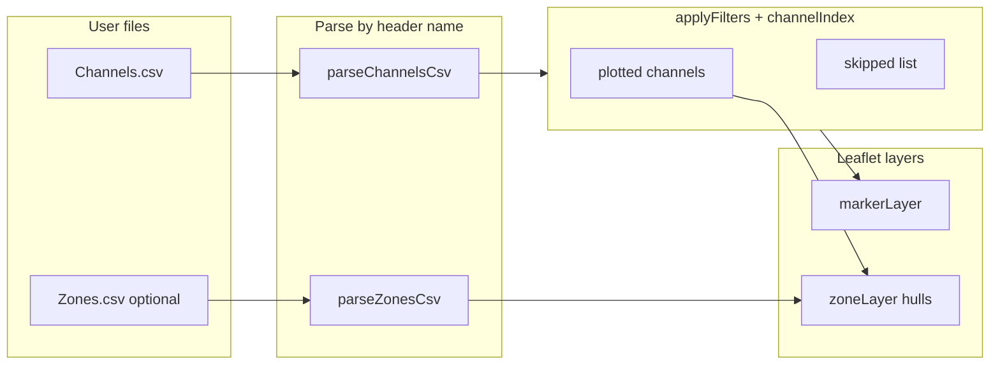

# Map tool

OpenGD77 CPS stores latitude and longitude on each channel and lists zone membership in a separate export, but the desktop CPS gives no geographic overview. The map tool loads those CSVs in the browser so you can see where repeaters sit, which channels lack coordinates, and whether zone footprints match the geography you intended when building a codeplug.

Implementation lives under [`tools/channel-map/`](../../../tools/channel-map/) — `index.html` plus `channel-map.js`. No application bundler; GitHub Pages publishes when a full GitHub release is published (see [build docs](../../build/README.md)). All parsing and rendering run client-side; CSV files never leave the machine.

## Implementation status

| Area | Status | Notes |
| --- | --- | --- |
| Channel markers | Shipped | FM / DMR / other colours, popups, merge co-located sites |
| Zone convex hulls | Shipped | Polygon, line (2 sites), circle (1 site); overlapping zones supported |
| Map tiles | Shipped | OpenStreetMap default; optional Mapbox streets / satellite |
| Filters & sidebar stats | Shipped | Shared coordinate rules for markers and zone hulls |
| Contacts / TG lists map layer | Deferred | Not geographic — out of scope for this tool |
| GitHub Pages deploy | Shipped | Publish GitHub release → `.github/workflows/pages.yml` |

## Documentation map

| Doc | Covers |
| --- | --- |
| [channels.md](channels.md) | `Channels.csv` parsing, markers, filters, popups, labelling |
| [zones.md](zones.md) | `Zones.csv` parsing, hull geometry, colours, multi-zone overlap |

User-facing quick start remains in the [repository README](../../../README.md).

## Concepts

| Term | Meaning in this tool |
| --- | --- |
| **Channel Name** | Primary key — zone members and lookups match this string **case-sensitively** |
| **Use Location** | OpenGD77 `Yes` / `No` on a channel row; when the filter is on, `No` rows are excluded from markers and zone hulls |
| **Plotted vs skipped** | A channel may exist in the CSV but be hidden by filters or missing/invalid coordinates |
| **Merged marker** | Several channels sharing the same lat/lon (to 5 decimal places) shown as one marker with a combined popup |
| **Zone hull** | Convex polygon around distinct geolocated sites referenced by a zone — not a radio coverage model |
| **channelIndex** | In-memory map of **plotted** channel names → channel objects; zone resolution uses only plotted channels |

## Data flow

Load order matters: **`Channels.csv` first**, then optional **`Zones.csv`**. Zones cannot be resolved until channels are loaded.

## Cross-links

| Resource | URL |
| --- | --- |
| Tool (source) | [`tools/channel-map/`](../../../tools/channel-map/) |
| Live (deployed) | [channel map](https://pskillen.github.io/opengd77-map/tools/channel-map/) |
| Build / deploy | [docs/build/README.md](../../build/README.md) |
| Local test CSVs | [`sample-exports/`](../../../sample-exports/) (gitignored) |
| Agent guide | [`AGENTS.md`](../../../AGENTS.md) |
| Feature docs skill | [`.cursor/skills/feature-docs/SKILL.md`](../../../.cursor/skills/feature-docs/SKILL.md) |

## Related tools

This is currently the only feature in the repository. Future tools should get their own folder under `docs/features/<topic>/` and a row in [docs/features/README.md](../README.md).
