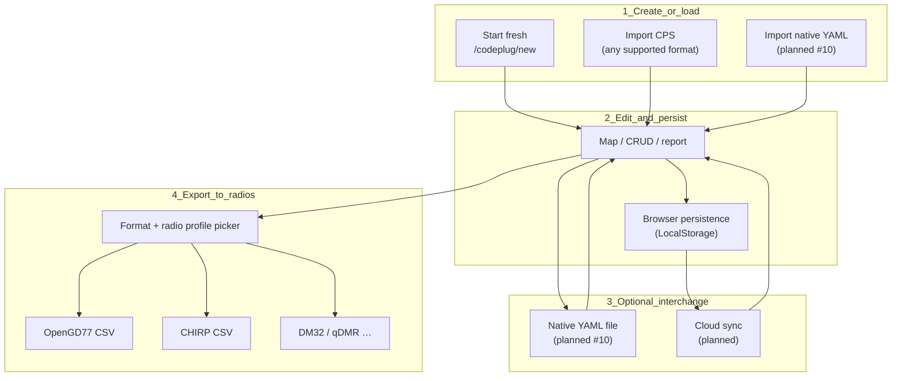

# Operator lifecycle

Canonical workflow for designing a codeplug in Codeplug Tool and flashing it to one or more physical radios. The internal [codeplug model](../data-model/README.md) is the hub; every CPS format is a lossy boundary at import and export.

**Tracking:** [codeplug-tool#103](https://github.com/pskillen/codeplug-tool/issues/103) (CHIRP + multi-format export)

## Workflow

### 1. Create or load

| Path | UI | Notes |
| --- | --- | --- |
| **Start fresh** | Home → **Start fresh** → `/codeplug/new` | Blank `Codeplug`; no persist until **Create** ([#102](https://github.com/pskillen/codeplug-tool/issues/102)) |
| **Import CPS** | Home or Import & export → drop folder or files | Format detected or selected via `?format=`; creates new project (home) or merges into active (Import & export) |
| **Import native YAML** | Planned ([#10](https://github.com/pskillen/codeplug-tool/issues/10)) | Lossless interchange format |

Import from **one** format does not lock the project to that format. The internal model is format-agnostic.

### 2. Edit and persist

Edit channels, zones, contacts, and talk groups via map, CRUD, and report views. Changes auto-save to browser **LocalStorage** ([persistence](../persistence/README.md)). Nothing is uploaded to a server.

### 3. Optional interchange

| Mechanism | Status | Role |
| --- | --- | --- |
| **LocalStorage** | Shipped | Session-to-session recall in the same browser |
| **Native YAML file** | Planned ([#10](https://github.com/pskillen/codeplug-tool/issues/10)) | Portable source of truth; full internal model |
| **Cloud provider** | Planned | Dropbox / OneDrive / Google Drive sync of YAML projects |

YAML and cloud are **interchange** layers — not a replacement for CPS export. Operators still export to vendor CSV (or similar) to flash a radio.

### 4. Export to one or more radios

When ready to update physical radios:

1. Open **Import & export** (`/export`).
2. Pick the **format** (OpenGD77, CHIRP, DM32, …) from the sidebar selector.
3. Pick a **radio profile** where the format requires it (OpenGD77 1701, CHIRP UV-5R, …).
4. Download CPS files and import them into the vendor CPS for flashing.

**One project, many exports.** The same codeplug can be exported to OpenGD77 for a DMR handheld and CHIRP for an analogue FM radio without re-importing. Each export applies format-specific mapping and may drop fields the target format does not support.

## Format vs variant vs profile

| Concept | Meaning | Examples |
| --- | --- | --- |
| **Format** | Wire interchange adapter | OpenGD77 CSV, CHIRP CSV, DM32 CSV, native YAML |
| **Variant** (OpenGD77 only) | Per-radio specialisation within one format | 1701, MD9600, GD-77 ([#72](https://github.com/pskillen/codeplug-tool/issues/72)) |
| **Profile** (CHIRP) | Per-radio memory/power limits at export | UV-5R Mini, UV-21ProV2, RT95 |

Project `targetRadios` on [codeplug-project](../codeplug-project/README.md) is **indicative operator notes** — it does not drive export. The format picker and profile selector on Import & export do.

## Cross-format loss (expected)

Export is **lossy** at each boundary. Documented per format in reference docs; summary:

| Direction | Typical loss |
| --- | --- |
| OpenGD77 → internal | Wire strings normalised; CPS row numbers not stored |
| CHIRP → internal | Channels only; no zones/contacts; DMR columns ignored |
| Internal → OpenGD77 | DMR fields serialised; analogue channels mapped to OpenGD77 wire |
| Internal → CHIRP | **Analogue channels only**; DMR/digital channels skipped with warning; `Location` assigned at export |
| OpenGD77 ↔ CHIRP | Zones, contacts, talk groups, RX lists, colour code, timeslot — not representable in CHIRP analogue CSV |

See [format-fidelity](../../build/testing/format-fidelity.md) for the adapter matrix.

## Related

- [Import / export hub](../import-export/README.md)
- [Codeplug projects](../codeplug-project/README.md)
- [Adding a new vendor format](../import-export/adding-a-new-vendor.md)
- [Format taxonomy](../import-export/format-taxonomy.md)
