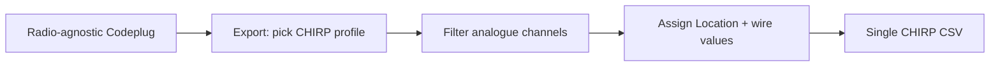

# CHIRP radio profiles

Per-radio constraints applied when exporting a codeplug to CHIRP CSV. Generic column semantics live in the parent [CHIRP reference](../README.md).

## Why profiles exist

CHIRP exports are **radio-specific** — memory capacity, power levels, and supported modes vary by driver. The wire column set is largely shared, but:

- **Memory slots** (`Location` max index) differ by radio model.
- **Power ladder** wire strings (`5.0W`, `10W`, `1.0W`, …) are radio-specific.
- **Filename** convention encodes radio model for operator identification.

The **internal codeplug model stays radio-agnostic**. Profiles apply at **export time** via the profile picker on Import & export.

## Intended export flow

Digital/DMR channels in a mixed project are **skipped** with warnings — CHIRP analogue export does not synthesise DMR rows.

## Profile index

| Profile id | Hardware | Fixture | Doc |
| --- | --- | --- | --- |
| `baofeng-uv5r-mini` | Baofeng UV-5R Mini | `Baofeng_UV-5R Mini_20251129.csv` | [baofeng-uv5r-mini.md](baofeng-uv5r-mini.md) |
| `baofeng-uv21prov2` | Baofeng UV-21Pro V2 | `Baofeng_UV-21ProV2_20251129.csv` | [baofeng-uv21prov2.md](baofeng-uv21prov2.md) |
| `retevis-rt95` | Retevis RT95 VOX | `Retevis_RT95 VOX_20251106.csv` | [retevis-rt95.md](retevis-rt95.md) |

## Related

- [channels.md](../channels.md)
- [Adapter behaviour](../../../features/import-export/chirp/README.md)
