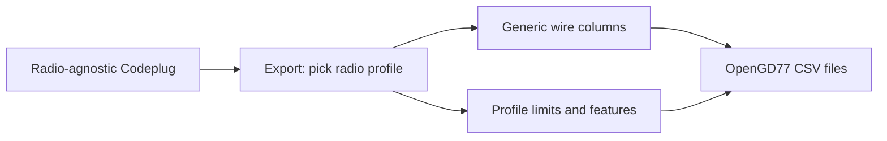

# OpenGD77 radio profiles

Radio profiles capture **hardware-specific constraints** that apply when serialising or validating a codeplug for a particular OpenGD77 target radio. Generic wire-format column semantics live in the parent [OpenGD77 reference](../README.md).

## Why profiles exist

OpenGD77 CPS CSV uses a **shared column set** across supported radios (GD-77, MD-UV380, DM-1701, etc.) — codeplugs are largely interchangeable between targets with the same firmware generation. However:

- **Cardinality** (max channels, zone member slots, TG list member slots) may differ by radio or CPS version.
- **Field display length** (channel name on radio LCD) varies.
- **Feature availability** (APRS configs, DTMF, hotspot, airband) depends on hardware and firmware.
- **Layout conventions** (lean promiscuous-RX model, zone-as-scan) are operator/radio choices documented per profile.

The **internal codeplug model stays radio-agnostic**. Profiles are applied at **export time** (and optionally recorded at import as a hint).

## Intended export flow

Today's shipped exporter uses the [Baofeng 1701](baofeng-1701.md) profile constants without a profile picker UI.

## Profile index

| Profile | Hardware | Status | Doc |
| --- | --- | --- | --- |
| Baofeng 1701 / Retevis RT-84 | Handheld | **Documented; adapter calibrated** | [baofeng-1701.md](baofeng-1701.md) |
| Radioddity GD-77 / TYT MD-760 | Handheld | Wire format shared; limits TBD | — |
| TYT MD-UV380 / Retevis RT-3S | Handheld | Wire format shared; limits TBD | — |
| TYT MD-9600 / Retevis RT-90 | Mobile | Wire format shared; limits TBD | — |
| Radioddity GD-77S | Headless | Operational differences only; wire format shared | — |

Add a row and doc file when a profile is researched and validated against CPS exports from that radio.

## Adding a new profile

1. Export a reference codeplug from OpenGD77 CPS on the target radio.
2. Compare headers and member column counts against [generic docs](../README.md).
3. Document limits and feature availability in `radios/<profile-slug>.md` using the constraint table template in [baofeng-1701.md](baofeng-1701.md).
4. Wire profile constants into export validation when [export profile selection](https://github.com/pskillen/codeplug-tool/issues/43) is implemented.

## Related

- [OpenGD77 reference hub](../README.md)
- [File format — export-time profiles](../file-format.md#export-time-radio-profiles)
- [Data model](../../../features/data-model/README.md)
