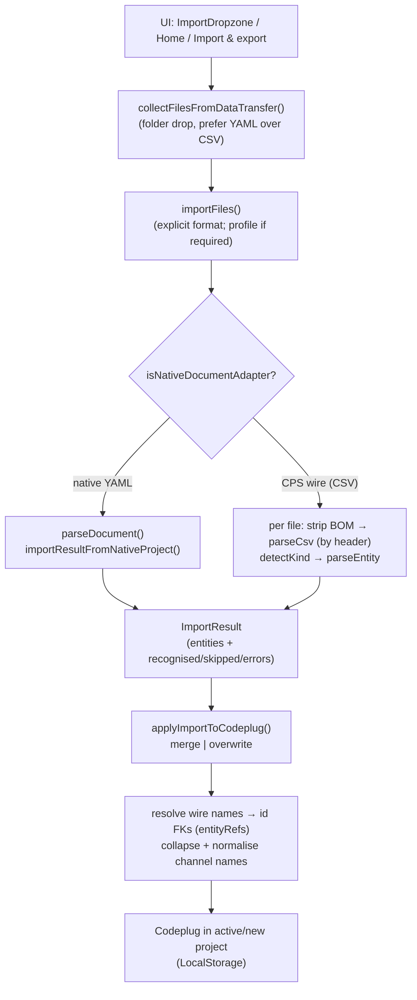
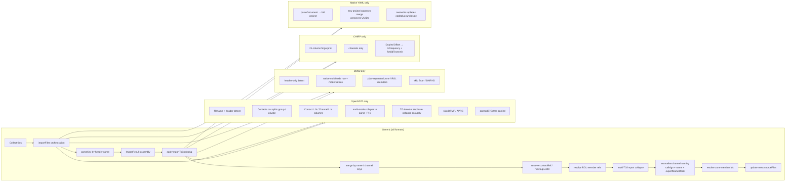
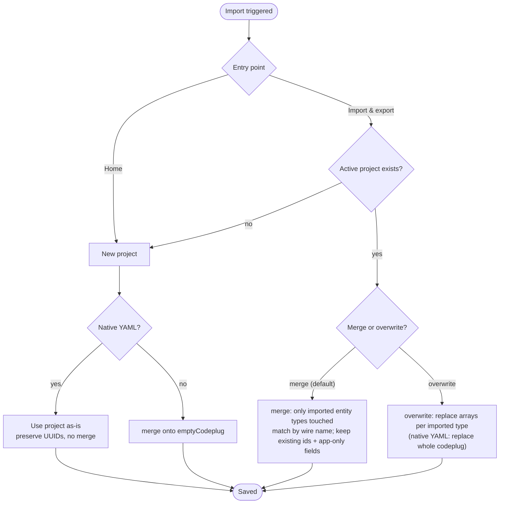
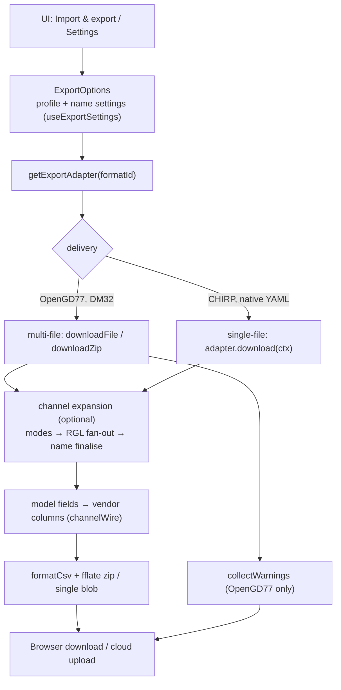
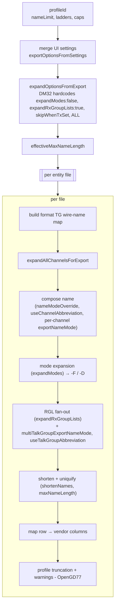
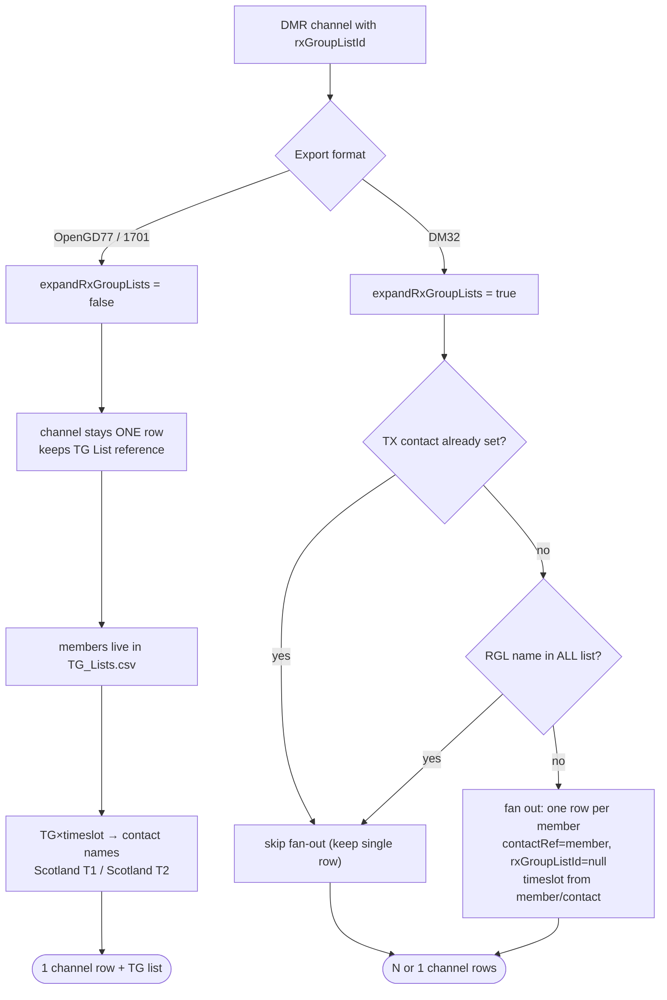
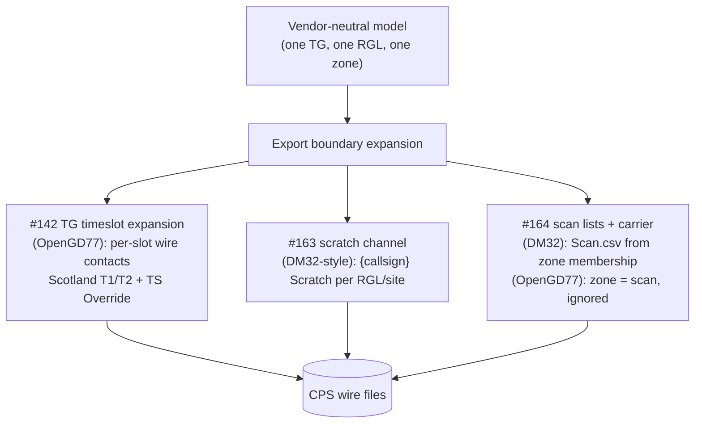

# Import & export flow diagrams (developer)

Working draft for [#135](https://github.com/pskillen/codeplug-tool/issues/135). **Audience: developers and agents.** Mermaid diagrams of the import and export pipelines, calling out the **generic trunk** vs **format-specific divergence**. Pairs with [`feature-reference.md`](feature-reference.md) and [`glossary-dev.md`](glossary-dev.md).

Legend used throughout:
- **Solid trunk** = generic, every format.
- **Subgraph per format** = divergence points.
- "boundary" = the import/export edge where vendor specifics are allowed.

---

## 1. Import — overview (generic trunk + format branches)

Key files: `src/lib/import/index.ts`, `src/lib/importMerge.ts`, `src/lib/entityRefs.ts`, `src/lib/channelNaming.ts`, `src/state/codeplugStore.tsx`.

---

## 2. Import — generic vs format-specific divergence

---

## 3. Import — merge vs new project (decision view)

Notes:
- Merge is **idempotent** — re-importing unchanged CPS is a no-op.
- Preview (`previewImportMerge`) runs the full apply without mutating the store, powering the confirm modal (unresolved zone members reported).

---

## 4. Export — overview (generic trunk + format branches)

> **Source of truth:** export serialises from **typed model fields**, never from `meta.imported.*Wire`. The only opaque carry is `opengd77Extras` (legacy approved).

---

## 5. Export — option application order (the part that confuses people)

Critical ordering facts:
- **Profile first** — everything else depends on its caps/limits.
- **Compose before shorten** — `nameModeOverride`/abbreviations decide the base name; shortening only kicks in afterwards if too long.
- **Expansion before shortening** — rows are multiplied (`-F`/`-D`, per-TG) *before* names are budgeted, so suffixes must fit within the limit.
- **Uniquify last** — global `reservedWireNames` ensures uniqueness across the whole export.

---

## 6. Export — RX group list divergence (the headline difference)

Why: OpenGD77 radios support **true promiscuous RX + independent TG selection**, so an RGL is a *reference*. DM32-class radios have **one TG per channel**, so the app *simulates* the RGL by **duplicating the channel** per member.

---

## 7. Where #142 / #163 / #164 hook in (future divergence)

All three follow the same principle already in the codebase: **denormalise at the export edge from a clean model**, format-aware, never leaking radio assumptions back into the model.

---

## 8. Rendering notes (for when these move into the site/docs)

- These render in GitHub markdown and Mantine via a mermaid component. If embedding in-app, sanitise labels (avoid raw `&`, `<`, `>` — already escaped here as `&amp;` etc.).
- For **user-facing** help, simplify: the operator only needs diagrams 3 (merge vs new) and 6 (RGL divergence), reworded in plain language. Diagrams 2, 5, 7 are contributor-only.
